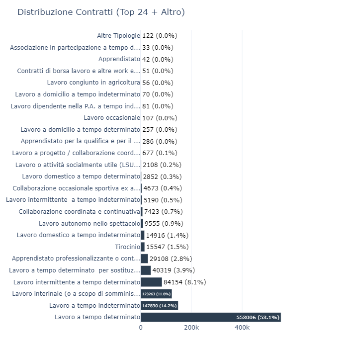
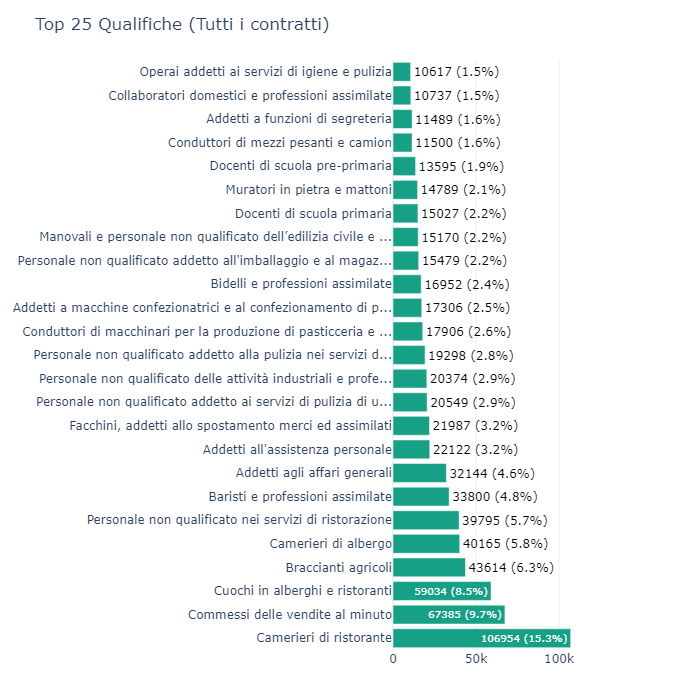
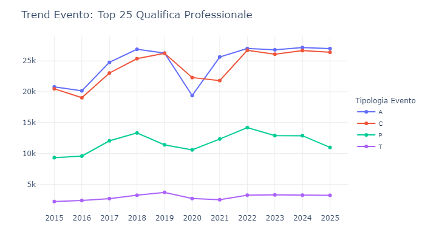
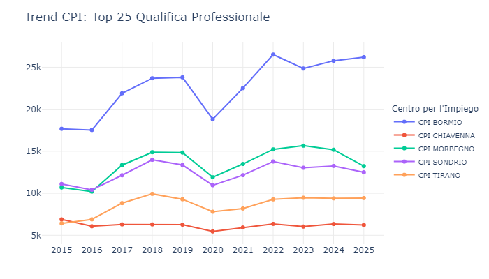
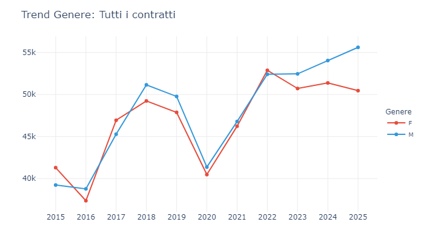
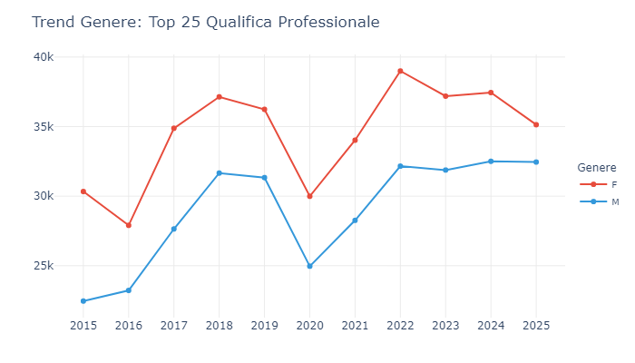
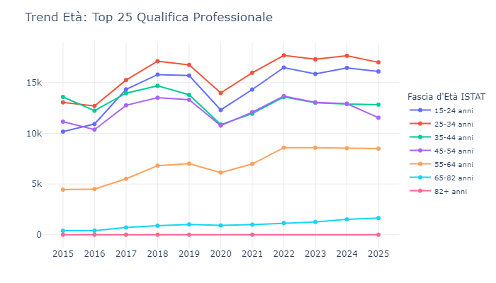
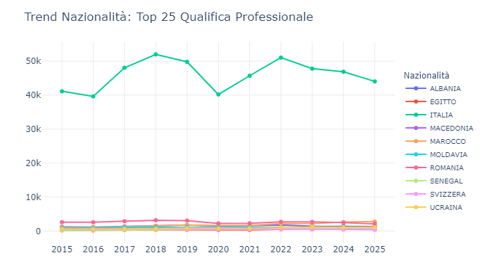
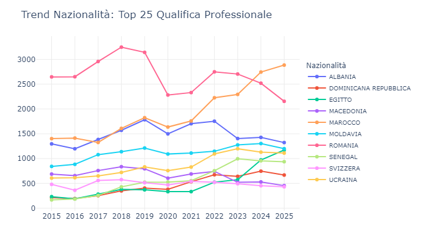

<!-- #  

# I contratti  nelle COB nel periodo 2015-2025 -->

In questa sezione analizziamo la ripartizione dei contratti e il dettaglio selezionato, relativo al periodo 2015-2025, per le Qualifiche professionali.

<!-- ## I contratti - Volumi complessivi -->

::: {.content-visible when-format="html"}
<iframe src="esportazioni_quarto/grafico_1_COB_tipologia_contratti_15-25a.html" width="100%" height="750px" style="border:none;"></iframe>
:::

::: {.content-visible when-format="pdf"}
{#fig-contratti width=100%}
:::

#### Il rumore di fondo: il motore a tempo determinato
Il dato dominante del Lavoro a tempo determinato (553.006 COB, 53,1%) assume un significato sistemico. In 11 anni, oltre mezzo milione di comunicazioni burocratiche sono state assorbite da questa tipologia. Questo volume aggregato non indica necessariamente mezzo milione di lavoratori diversi, ma certifica un mercato che "respira" attraverso rinnovi continui, proroghe e riattivazioni stagionali. È la prova che per oltre un decennio il tessuto produttivo ha scelto di gestire il rischio di impresa scaricandolo sulla flessibilità contrattuale, generando un traffico amministrativo incessante.

##### La stabilità silenziosa
Al secondo posto troviamo il Lavoro a tempo indeterminato con 147.830 COB (14,2%). Letto su un orizzonte temporale di 11 anni, questo indicatore va interpretato in positivo: le assunzioni stabili (o le trasformazioni) generano per natura pochissime registrazioni. Un lavoratore stabile produce una singola comunicazione, per poi radicarsi scomparendo dai radar del turnover. Questo 14,2% rappresenta quindi la spina dorsale dell'economia territoriale, il vero terrazzamento a cui il mercato tende dopo aver filtrato la forza lavoro attraverso la maglia dei contratti a termine.

##### I banchi di prova e gli ammortizzatori (agenzie e chiamata)
Il Lavoro interinale (123.263 COB, 11,8%) e il Lavoro intermittente (84.154 COB, 8,1%) hanno svolto la funzione di ammortizzatori strutturali dell'ultimo decennio. Hanno permesso alle imprese di arginare le crisi, lo spartiacque pandemico e le improvvise escursioni della domanda. In 11 anni, queste due forme hanno prodotto oltre 200.000 movimentazioni, confermando l'esistenza di un sotto-mercato di "pronto intervento", vitale per i comparti maggiormente esposti a repentini cambi di pressione economica, come il commercio, la logistica e l’industria.

##### Il ricambio generazionale lento
Scorrendo le COB dell'intero periodo storico, i canali formativi ufficiali mostrano volumi contenuti: le attivazioni di Apprendistato professionalizzante sfiorano le 30.000 unità (2,8%), seguite dai Tirocini (15.547, 1,5%). Distribuite su 11 anni, queste cifre descrivono una sorgente costante ma misurata di nuove leve. Le imprese locali sembrano preferire l'inserimento dei giovani tramite contratti a termine operativi, testandoli sul campo per brevi periodi, piuttosto che incanalare le risorse in percorsi formativi di lungo respiro come l'apprendistato.

##### L'erosione delle vecchie nicchie e la "coda lunga"
L'osservazione dell'arco temporale 2015-2025 rivela gli effetti della profonda evoluzione normativa italiana. Forme un tempo diffuse come le Collaborazioni coordinate e continuative (7.423 COB) o il Lavoro a progetto (677 COB) appaiono oggi del tutto residuali. Tale erosione è così radicale che decine di micro-forme contrattuali desuete sommano in totale appena 122 COB in un decennio. I vari interventi legislativi hanno agito come un disgelo normativo, sciogliendo queste nicchie periferiche per farle confluire nei due grandi bacini del lavoro a tempo determinato e della somministrazione.

##### In sintesi
La lettura integrale di questi dati storici consegna un'evidenza strutturale: l'iper-flessibilità non è una risposta a una crisi temporanea, ma rappresenta ormai il clima operativo standard. Il mercato analizzato si regge su un'altissima intensità amministrativa, in cui gran parte delle risorse viene impiegata per assecondare il continuo pendolarismo dei contratti a breve termine. Questa fluttuazione incessante ha lo scopo ultimo di alimentare e proteggere quel nucleo stabile del 14%, il vero presidio che mantiene in equilibrio l'intero sistema produttivo della provincia.



## Le qualifiche - Analisi di dettaglio (Top 25)

Il focus sulle singole qualifiche (o settori) ci permette di capire esattamente quali professionalità sono attualmente richieste dal tessuto produttivo.

::: {.content-visible when-format="html"}
<iframe src="esportazioni_quarto/grafico_2_COB_qualifiche_25_cat_contratti_15-25a.html" width="120%" height="750px" style="border:none;"></iframe>
:::

::: {.content-visible when-format="pdf"}
{#fig-dettaglio width=100%}
:::

#### Il gigante dell'ospitalità e della ristorazione
Il dato che domina il panorama statistico è il volume di comunicazioni legate all'accoglienza. Al vertice troviamo i Camerieri di ristorante con 106.954 COB (15,3%). Unendo a questo dato i Cuochi (8,5%), i Camerieri di albergo (5,8%), il Personale non qualificato (5,7%) e i Baristi (4,8%), si ottiene una massa critica che assorbe oltre il 40% del traffico totale. In undici anni, questo comparto, trainato in gran parte dall'economia d'alta quota, ha generato un vero e proprio torrente lavorativo: un deflusso ininterrotto di avviamenti e cessazioni, governato dalla stagionalità, capace di produrre una mole documentale imponente.

#### Commercio al minuto e ciclicità agricola
Il secondo pilastro del decennio è rappresentato dai Commessi delle vendite (67.385 COB, 9,7%). Questo volume riflette la natura del settore retail, esposto alle medesime escursioni stagionali del turismo. Di grande rilievo è il quarto posto dei Braccianti agricoli (43.614 COB, 6,3%). Su un arco di undici anni, questo numero testimonia la ciclicità ritmica legata alle colture di fondovalle, alle storiche colture di terrazzamento e alle campagne di raccolta: ogni anno, all'arrivo della stagione, migliaia di COB vengono aperte e chiuse in pochi mesi, cumulando un volume che spesso supera l'indotto di settori industriali apparentemente più continui.

#### Logistica, manutenzione e servizi di pulizia
Il grafico mappa poi quello che possiamo definire il "motore di servizio" del territorio. Facchini (3,2%), addetti al confezionamento (2,5%) e al magazzino (2,2%) formano il cuore di un settore che ha registrato una decisa ascesa nelle movimentazioni. Parallelamente, il comparto delle pulizie mostra una solida resilienza amministrativa. Trattandosi spesso di lavori frammentati, utilizzati per garantire un presidio continuo o per brevi sostituzioni, si comprende l'elevata densità di comunicazioni obbligatorie prodotte nel lungo periodo.

#### L'infrastruttura del welfare e l'istruzione
Un aspetto interessante del periodo 2015-2025 è la presenza costante delle professioni di cura e insegnamento. Gli Addetti all'assistenza personale (22.122 COB, 3,2%) indicano un bisogno sociale che non si è mai fermato, traducendosi in una serie continua di rapporti di lavoro domestico o assistenziale. Per quanto riguarda la scuola, la presenza di Bidelli e Docenti (primaria e pre-primaria) tra le prime 25 posizioni è il segnale plastico del precariato storico nell'istruzione: ogni anno scolastico migliaia di contratti scadono a giugno e vengono riattivati a settembre, gonfiando il database delle COB con una regolarità quasi rituale.

#### Edilizia e industria di trasformazione alimentare
Il decennio ha registrato, inoltre, un transito strutturale di Muratori (2,1%) e Manovali (2,2%), professioni le cui tempistiche d'impiego sono naturalmente legate alla durata dei cantieri. Di particolare interesse statistico è la presenza dei Conduttori di macchinari per pasticceria e panificazione (2,6%): tale evidenza conferma la radicata vocazione dell'industria alimentare locale, un settore capace di incanalare flussi occupazionali rilevanti e continuativi, svincolati dalla mera stagionalità turistica, ma, come vedremo di seguito, non meno esposti a picchi di turnover.

#### In sintesi
Negli ultimi undici anni, la "macchina" del lavoro ha prodotto COB principalmente per professioni operative e di servizio. Il grafico non ci dice che ci sono più camerieri che ingegneri in senso assoluto, ma ci dice che il lavoro di cameriere, commesso o bracciante è quello che ha richiesto più interventi amministrativi, più firme e più rinnovi. È il ritratto di un'economia che si basa su una forza lavoro estremamente mobile, che entra ed esce dal mercato con una frequenza elevatissima per sostenere i settori portanti del territorio.



## Gli eventi - Analisi di dettaglio (tutti i contratti e solo le Top 25 qualifiche)

::: {.content-visible when-format="html"}
<iframe src="esportazioni_quarto/grafico_5_COB_EVENTI_tipologia_contratti_15-25a.html" width="100%" height="500px" style="border:none;"></iframe>
<iframe src="esportazioni_quarto/grafico_6_COB_EVENTI_qualifiche_25_cat_contratti_15-25a.html" width="100%" height="500px" style="border:none"></iframe>
:::

::: {.content-visible when-format="pdf"}
{#fig-dettaglio width=100%}
{#fig-dettaglio width=100%}
:::

Nel sistema delle Comunicazioni Obbligatorie (COB), le lettere (A, C, P, T) non sono semplici etichette, ma i quattro movimenti vitali di un contratto: A (Avviamenti - assunzioni), C (Cessazioni - fine rapporto), P (Proroghe - prolungamenti) e T (Trasformazioni - passaggi, es. da tempo determinato a indeterminato).
Ecco la lettura strategica del decennio 2015-2025 attraverso queste quattro lenti.

#### La "porta girevole": avviamenti e cessazioni
Osservando gli eventi, emerge immediata la perfetta simmetria tra la linea blu (Avviamenti) e quella rossa (Cessazioni). Nel quinquennio 2015-2019, le curve avanzano affiancate: a circa 38.000 attivazioni corrispondono volumi quasi identici di chiusure. Questa fisiologica sovrapposizione conferma che il mercato non genera 38.000 nuove posizioni nette l'anno, bensì alimenta un turnover ciclico e serrato sulle medesime mansioni. È un sistema che si arrampica su volumi amministrativi elevatissimi per mantenere, alla fine del ciclo stagionale, un saldo occupazionale sostanzialmente in pareggio.

#### Il saldo pandemico: l'emorragia del 2020
L'analisi dell'annualità 2020 registra un profondo avvallamento statistico. Lo shock pandemico provoca un improvviso congelamento delle dinamiche lavorative: gli Avviamenti (A) precipitano a 28.604 unità, mentre le Cessazioni (C) flettono in misura minore, fermandosi a 32.018. Rappresenta l'unico anno del decennio in cui la curva delle uscite sormonta nettamente quella delle entrate. Il mercato ha interrotto la fase di reclutamento, lasciando che i contratti a termine giungessero a scadenza naturale senza subire alcun rinnovo o proroga.

#### La proroga come ammortizzatore sistemico
La traiettoria delle Proroghe (P) evidenzia una precisa cautela organizzativa delle imprese. La curva si mantiene costantemente su volumi altissimi, scalando dalle 14.900 unità del 2015 fino all'altopiano di oltre 20.000 nel 2022. Di fronte a un contesto economico esposto a escursioni repentine, il tessuto aziendale opta sistematicamente per l'estensione del contratto in essere piuttosto che per nuove attivazioni o stabilizzazioni. Si tratta di una strategia di breve periodo tesa a dilazionare i rischi organizzativi di stagione in stagione. Questo volume così alto di proroghe conferma che la flessibilità non è usata solo per coprire picchi improvvisi, ma è una modalità strutturale per dilazionare le decisioni a lungo termine.

#### La lenta corsa verso la stabilità (trasformazioni)
Sul livello inferiore del grafico, la linea delle Trasformazioni (T), che come sappiamo rappresentano in misura rilevante le stabilizzazioni a tempo indeterminato, descrive un andamento marginale nei volumi, ma essenziale nella sostanza. Le stabilizzazioni a tempo indeterminato delineano un trend di crescita solido, impermeabile persino alla crisi sanitaria. Partite da 4.100 nel 2015, si posizionano sulla vetta delle 6.363 unità nel 2025. Tale evidenza certifica come il tessuto produttivo abbia aumentato del 50% la propria capacità di consolidare i rapporti lavorativi, cercando di arginare la dispersione di competenze acquisite sul campo. Si tratta di un dato che cerca, però, conferme nel dettaglio delle qualifiche più richieste, per capire se questa crescita è generalizzata o concentrata su specifici profili professionali. Un aspetto che approfondiremo in prossime ricerche.

#### In sintesi
L'analisi temporale degli eventi restituisce l'immagine di un mercato ad alto dislivello amministrativo, che richiede la movimentazione di enormi volumi contrattuali (Avviamenti e Cessazioni) per generare un consolidamento occupazionale relativamente contenuto (Trasformazioni). È un ecosistema governato dalla flessibilità stagionale, dove le Proroghe agiscono come sbarramento protettivo per la programmazione aziendale. Nondimeno, la crescita lenta e ininterrotta delle Trasformazioni indica che, esaurite le fluttuazioni di breve periodo, il tessuto economico tende progressivamente a radicare le proprie competenze migliori.

Per completezza d'indagine, l'osservazione delle Top 25 qualifiche restituisce dinamiche speculari a quelle dell'aggregato generale. Questa simmetria strutturale conferma che le principali 25 mansioni fungono da indicatore primario per le correnti dell'intero bacino contrattuale, permettendo di estendere le presenti conclusioni senza necessitare di ulteriori distinguo.



## I Centri per l'Impiego (CPI) - Analisi territoriale: distribuzione delle COB per CPI (2015-2025)

La scomposizione dei flussi delle COB sui cinque Centri per l'Impiego restituisce l'immagine di un territorio economicamente organizzato su versanti asimmetrici. L'andamento dell'ultimo decennio non evidenzia solo una chiara gerarchia quantitativa, ma certifica livelli di crescita e resilienza profondamente difformi tra i crinali turistici dell'Alta Valle e le dinamiche del fondovalle.

::: {.content-visible when-format="html"}
<iframe src="esportazioni_quarto/grafico_9_COB_CPI_tutti_contratti_1525.html" width="100%" height="500px" style="border:none;"></iframe>
<iframe src="esportazioni_quarto/grafico_10_COB_CPI_top25Qualif_1525.html" width="100%" height="500px" style="border:none;"></iframe>
:::

::: {.content-visible when-format="pdf"}
{#fig-dettaglio width=100%}
{#fig-dettaglio width=100%}
:::

#### La mappa territoriale: i pesi del 2025
Per misurare i dislivelli attuali del mercato, è fondamentale scattare una fotografia dei volumi nel 2025. A fronte di oltre 106.000 comunicazioni complessive, la ripartizione delinea una morfologia occupazionale dominata da tre poli principali: CPI Bormio (32,5%), CPI Morbegno (23,4%) e CPI Sondrio (21,2%). Seguono Tirano e Chiavenna a chiudere la distribuzione con il 13,4% (14.203) e il 9,5% (10.135). Questo dato indica che un terzo dell'intera movimentazione contrattuale provinciale trova la propria sorgente in Alta Valtellina.

#### Bormio: il polo trainante dell'Alta Valle
Il dato più dirompente del decennio è la performance del CPI di Bormio. Nel 2015 il distretto registrava circa 23.400 COB, ma nel corso degli anni ha innescato una marcia che nessun altro territorio è riuscito a eguagliare. Nonostante la fisiologica e pesante flessione del 2020 (scesa a 24.300 unità), il rimbalzo post-pandemico è stato rilevante. Il CPI ha superato la soglia delle 33.000 COB già nel 2022, per poi consolidarsi sui massimi del 2025. Questo trend certifica la potenza del comparto turistico e ricettivo dell'Alta Valle, vero e proprio motore trainante locale, caratterizzato da un altissimo turnover e da una forte stagionalità.

#### Il riassetto nel Centro Valle: le dinamiche di Morbegno e Sondrio
Nelle fasce mediane del grafico si osserva un importante fenomeno socio-economico: il superamento del capoluogo da parte della Bassa Valle. Nel 2015, il CPI di Sondrio (18.699) superava, seppur di poco, quello di Morbegno (17.975). Tuttavia, tra il 2017 e il 2018, Morbegno accelera in modo deciso, operando un sorpasso strutturale. Da quel momento, il bacino morbegnese si mantiene costantemente al di sopra di quello del capoluogo (con un picco di quasi 26.000 COB nel 2023), dimostrando una vocazione industriale e commerciale più dinamica rispetto all'area di Sondrio, maggiormente legata al settore dei servizi e del pubblico impiego.

#### Le dinamiche dei bacini decentrati: Tirano e Chiavenna
I bacini geograficamente più decentrati esibiscono reazioni contrapposte. Tirano delinea una curva in solida ascesa: partendo da 10.800 COB nel 2015 si porta, con incrementi regolari, a oltre 14.000 nel 2025 (+31%). Di contro, Chiavenna rappresenta l'unico CPI caratterizzato da una sostanziale staticità. Congelata in un perimetro che oscilla decennalmente tra le 8.500 e le 10.300 unità, la Valchiavenna restituisce l'immagine di un ecosistema a sé stante: meno permeabile alle repentine ondate di crescita, ma proporzionalmente isolato dalle contrazioni sistemiche.

#### In sintesi
Il mercato provinciale non viaggia a una sola velocità. Più di un terzo del dinamismo delle COB è concentrato nell'hub di Bormio (32,5%), trainato dall'economia turistica. Nel fondovalle, il distretto di Morbegno ha definitivamente superato il capoluogo Sondrio per volume di movimentazioni, affermandosi come secondo polo economico (23,4%). Questa mappa asimmetrica richiede politiche attive del lavoro fortemente territorializzate, differenziando gli interventi tra le aree ad alto turnover (Bormio, Morbegno) e le zone a bassa mobilità (Chiavenna).



## Il genere tra contratti e qualifiche - Analisi di dettaglio (Top 25)

Analizzando le linee di tendenza dal 2015 al 2025 per l'insieme di tutti i contratti, scopriamo come il traffico amministrativo delle Comunicazioni Obbligatorie (COB) si è distribuito tra uomini e donne lungo un intero decennio.
Ecco la radiografia delle dinamiche di genere.

### L'analisi di genere nei contratti: bilancio decennale

::: {.content-visible when-format="html"}
<iframe src="esportazioni_quarto/grafico_3_COB_SEX_tipologia_contratti_15-25a.html" width="100%" height="500px" style="border:none;"></iframe>
:::

::: {.content-visible when-format="pdf"}
{#fig-dettaglio width=100%}
:::

#### L'equilibrio iniziale delle movimentazioni (2015-2017)
All'inizio del decennio di osservazione, le curve dei due generi si muovono in modo quasi speculare, testimoniando un mercato che imponeva la stessa intensità di turnover a entrambi i sessi. Nel 2015, il volume totale di COB per le donne era leggermente superiore (41.300 comunicazioni contro le 39.232 maschili). Questo parallelismo iniziale conferma che il motore della flessibilità non faceva sconti a nessuno: il sistema di proroghe e rinnovi tipico dei contratti brevi assorbiva in egual misura la forza lavoro maschile e femminile.

#### La biforcazione delle traiettorie (2018-2019)
Tra il 2017 e il 2018 si registra un innalzamento dei volumi per entrambi i generi, accompagnato da un incrocio statistico rilevante. Le movimentazioni maschili subiscono un'accelerazione più marcata, scavalcando nel 2018 la soglia delle 51.150 COB e segnando un primo dislivello rispetto alla componente femminile. Questa fase indica un'espansione trainata da settori a prevalente vocazione maschile, caratterizzati da una gestione amministrativa fortemente frammentata.

#### L'avvallamento pandemico (2020)
Il grafico illustra l'entità dello spartiacque del 2020. Le due linee precipitano simultaneamente, generando un profondo avvallamento. Il volume delle COB femminili scende a 40.477, quello maschile a 41.368. Il blocco delle attività ha indotto un congelamento totale dei flussi documentali: migliaia di rinnovi non si sono concretizzati, lasciando spazio a un'interruzione di massa. La simmetria della flessione dimostra come entrambi i generi fossero egualmente esposti alla paralisi dell'economia locale.

#### Il rimbalzo e la "forbice" del turnover recente (2021-2025)
La ripresa post-Covid è vigorosa, ma disegna due destini divergenti nel volume amministrativo del lavoro. Nel 2022 si tocca un picco comune (circa 52.500 COB), ma dal 2023 la traiettoria si spezza. Mentre il volume di COB femminili si stabilizza su un plateau, chiudendo il 2025 in lieve flessione a quota 50.460, la linea maschile continua a salire inesorabilmente. Nel 2025 viene toccato il record assoluto del decennio con oltre 55.600 comunicazioni complessive.

#### In sintesi
L'analisi temporale restituisce l'immagine di un mercato ad alta intensità per ambo i sessi, segnato però da una recente e specifica spinta amministrativa per la componente maschile. Questo dislivello strutturale (oltre 5.000 COB di scarto nel 2025) costituisce l'evidenza centrale: indica che le professioni maschili stanno attraversando un ciclo di esasperata fluttuazione contrattuale. Di contro, dopo il picco di ripartenza, le dinamiche femminili appaiono confinate in una fase di stagnazione, caratterizzata da ritmi burocratici più contenuti.

\
\
\
\

### L'impatto di genere nelle qualifiche trainanti

L'isolamento delle prime 25 qualifiche per volume burocratico offre una prospettiva inattesa. Mentre il bacino aggregato mostrava un recente vantaggio maschile, il focus esclusivo sul cuore operativo del mercato restituisce un quadro diametralmente opposto.

::: {.content-visible when-format="html"}
<iframe src="esportazioni_quarto/grafico_4_COB_SEX_qualifiche_25_cat_contratti_15-25a.html" width="100%" height="500px" style="border:none;"></iframe>
:::

::: {.content-visible when-format="pdf"}
{#fig-dettaglio width=100%}
:::

#### L'ecosistema a prevalenza femminile
All'interno delle Top 25 qualifiche, la traiettoria femminile si mantiene ininterrottamente al di sopra di quella maschile per l'intero decennio. Nel 2015 la distanza è strutturale: oltre 30.000 COB contro le circa 22.400 degli uomini. Questa distribuzione riflette la composizione settoriale delle professioni più movimentate, dominate da comparti a radicata presenza femminile (ristorazione, commercio, industria di trasformazione alimentare, pulizie, assistenza, istruzione). Si conferma pertanto che le fondamenta amministrative del territorio poggiano saldamente su una base lavorativa femminile.

#### Le dinamiche di concentrazione
La lettura combinata dei due grafici evidenzia una segregazione occupazionale latente. Mentre nell'aggregato totale la forza lavoro maschile predomina, nelle prime 25 mansioni il primato resta femminile. Se ne deduce un'elevata concentrazione delle donne in una cordata chiusa di servizi essenziali. Le attivazioni maschili, al contrario, si disperdono in un ampio bacino di professioni frammentate (tecnici, piccola industria, edilizia) che, singolarmente intese, non raggiungono i vertici statistici, ma che in aggregato generano volumi dominanti.

#### La tenuta e lo shock sistemico (2015-2022)
Fino al 2019, le attivazioni femminili scalano quota 36.200, seguite da quelle maschili a 31.000. Il congelamento del 2020 scava una "V" simmetrica, portando le donne a 29.900 unità e gli uomini a 24.900. Il successivo disgelo è repentino: nel 2022, agevolate dalla riapertura dei servizi e dell'accoglienza, le attivazioni femminili toccano la loro vetta storica nella Top 25, lambendo le 39.000 registrazioni.

#### La stabilizzazione recente (2023-2025)
L'ultimo triennio mostra un fenomeno di stagnazione molto interessante. Dopo il picco del 2022, la linea femminile inizia una discesa lenta ma costante, chiudendo il 2025 a 35.135 attivazioni. La linea maschile, invece, si "piattisce", mantenendo un volume stabile intorno alle 32.400 unità. Il divario si sta leggermente restringendo, ma il dato reale è che il forte turn-over nei servizi di base ha smesso di crescere. Questo raffreddamento potrebbe indicare due cose: o una stabilizzazione delle assunzioni in questi settori (più contratti lunghi, quindi meno COB), oppure un vero e proprio rallentamento economico del commercio e dell'accoglienza negli ultimissimi anni storici.

#### In sintesi 
Il restringimento del campo d'indagine conferma una strutturale segregazione orizzontale. All'interno delle mansioni a più alta rotazione e flessibilità del territorio, la prestazione temporanea è sistematicamente erogata da manodopera femminile. Questa evidenza suggerisce che qualsivoglia politica attiva o intervento normativo incanalato verso queste 25 professioni, finirà per incidere in modo diretto e prioritario sugli equilibri dell'occupazione femminile provinciale.



## I profili demografici del mercato: contratti e qualifiche 

La scomposizione delle COB per fasce d'età ISTAT, nell'ambito di tutti i contratti e solo per le Top 25 qualifiche, illustra un mercato attraversato da profonde modificazioni anagrafiche. Nel decennio, il bacino della forza lavoro non si è unicamente espanso, ma ha alterato la propria morfologia interna, evidenziando una netta polarizzazione ai margini della curva demografica.

::: {.content-visible when-format="html"}
<iframe src="esportazioni_quarto/grafico_11_COB_ETA_ISTAT_tutti_contratti_1525.html" width="100%" height="500px" style="border:none;"></iframe>
<iframe src="esportazioni_quarto/grafico_12_COB_ETA_ISTAT_top25Qualif_1525.html" width="100%" height="500px" style="border:none;"></iframe>
:::

::: {.content-visible when-format="pdf"}
{#fig-dettaglio width=100%}
{#fig-dettaglio width=100%}
:::

#### La fascia centrale e la saturazione dei 25-34enni
Il crinale portante del mercato è storicamente costituito dalla fascia 25-34 anni, passata dalle 21.000 COB del 2015 alle oltre 28.100 nel 2025 (+33%). Rappresenta il baricentro assoluto in termini di volumi. Tuttavia, circoscrivendo l'analisi alle Top 25 qualifiche, si percepisce un progressivo livello di saturazione: pur guidando le statistiche, questo segmento cede gradualmente i volumi del ricambio fisiologico a favore delle generazioni emergenti.

#### L'avanzata della Gen Z: l'iper-accelerazione della fascia 15-24
Alle spalle del gruppo principale si rileva la decisa espansione della fascia 15-24 anni. Questa coorte ha segnato una vigorosa progressione, evolvendo da 15.300 a oltre 23.800 COB (+55%). La spinta si fa più acuta nelle Top 25 qualifiche, le quali assorbono quasi interamente la forza lavoro in ingresso. Si conferma così che le posizioni ad alto turnover stagionale e turistico fungono da sorgente primaria per le primissime esposizioni contrattuali della nuova generazione lavorativa, ormai dominata dalla Generazione Z.

#### L'invecchiamento della forza lavoro
Se le fasce giovanili ampliano i volumi, sono i segmenti maturi a registrare le incidenze percentuali più severe. La fascia 55-64 anni ha raddoppiato il proprio peso, passando dalle 6.600 COB del 2015 alle oltre 13.300 nel 2025. Di proporzioni maggiori l'aumento per la coorte 65-82 anni, quasi quadruplicata (da 700 a 2.600 unità). Questo fenomeno di senescenza contrattuale testimonia un progressivo arroccamento delle risorse più anziane, spesso reintegrate mediante rapporti flessibili per mitigare le carenze di competenze o per necessità sussidiarie al reddito pensionistico.

#### La staticità delle fasce intermedie (35-54 anni)
In netto contrasto con gli estremi della curva, le fasce anagrafiche centrali mostrano un andamento piatto o di crescita modesta. Il gruppo 35-44 anni è rimasto sostanzialmente congelato in un decennio (da 20.400 a 20.200 COB, con flessioni significative negli anni intermedi), mentre la fascia 45-54 anni ha registrato una crescita debole, stabilizzandosi intorno alle 17.800 COB. Questo "svuotamento" centrale suggerisce due fenomeni: da un lato, l'uscita da dinamiche contrattuali flessibili verso l'occupazione a tempo indeterminato; dall'altro, l'inesorabile declino demografico (calo delle nascite) che inizia a svuotare le coorti centrali della popolazione attiva.

#### In sintesi
Il mercato del lavoro sta subendo una polarizzazione demografica estrema, un fenomeno che risulta ancora più accentuato all'interno delle professioni trainanti. Se da un lato il bacino generale è tenuto in vita dai volumi dei 25-34enni, il vero "motore" del turnover nelle qualifiche di base è oggi la Generazione Z (15-24 anni). Al contempo, si assiste a una stagnazione delle fasce intermedie (35-54 anni) e all'esplosione delle COB tra gli over 55 e over 65, segno di un inarrestabile invecchiamento della forza lavoro attiva. Le politiche aziendali dovranno imparare a gestire questa complessa convivenza intergenerazionale, bilanciando l'iper-mobilità dei giovanissimi con la valorizzazione di una componente senior in forte espansione. Il confronto di questi dati con un modello che prevedeva una certa stabilità lavorativa degli over 55 porta inevitabilmente ad altri temi che affidiamo a future ricerche: la crescita delle COB relativa agli over 55 è concentrata in specifiche qualifiche? E' un fenomeno generalizzato o limitato a pochi settori economici? Quali sono le implicazioni per la gestione delle risorse umane e per le politiche attive del lavoro?



## Le dinamiche di nazionalità: l'evoluzione del bacino occupazionale 
L'analisi dei flussi delle COB nell'ultimo decennio (per tutti i contratti, per le Top 25 qualifiche e per le 25 nazionalità più rappresentate) restituisce la fotografia di un mercato del lavoro in profonda mutazione strutturale. Osservando le prime nazionalità per volume di movimentazioni, emerge un ecosistema che, pur rimanendo fortemente ancorato a un solido nucleo domestico, sta vivendo uno stravolgimento radicale all'interno della sua componente migratoria. Per semplificare la visualizzazione riportiamo nei grafici solo le prime 10 nazionalità più numerose e rimandiamo per maggiore completezza alle tabelle relative nell'appendice statistica.

::: {.content-visible when-format="html"}
<iframe src="esportazioni_quarto/grafico_7_COB_NAZ_Tutti_contr_1525_solo_10_naz.html" width="100%" height="500px" style="border:none;"></iframe>
<iframe src="esportazioni_quarto/grafico_8_COB_NAZ_top25Qualif_1525_solo_10_naz.html" width="100%" height="500px" style="border:none;"></iframe>
:::

::: {.content-visible when-format="pdf"}
{#fig-dettaglio width=100%}
{#fig-dettaglio width=100%}
:::

*Dettaglio grafico esclusa l'Italia della distribuzione delle nazionalità (nella versione interattiva è possibile esplorare i dati in modo dinamico già dal grafico iniziale)*

::: {.content-visible when-format="html"}
<iframe src="esportazioni_quarto/grafico_7_COB_NAZ_Tutti_contr_1525_solo_10_naz_senza_Italia.html" width="100%" height="500px" style="border:none;"></iframe>
<iframe src="esportazioni_quarto/grafico_8_COB_NAZ_top25Qualif_1525_solo_10_naz_senza_Italia.html" width="100%" height="500px" style="border:none;"></iframe>
:::

::: {.content-visible when-format="pdf"}
{#fig-dettaglio width=100%}
{#fig-dettaglio width=100%}
:::

#### Le proporzioni del mercato: italiani vs. non italiani
Il dato di partenza fondamentale per comprendere la tenuta del sistema è il rapporto di forza tra la manodopera locale e quella estera. Considerando il bacino delle prime 25 nazionalità nell'ultimo anno di rilevazione (2025), la componente italiana rappresenta circa il 74% del mercato totale (con oltre 74.400 COB), lasciando il restante 26% alla forza lavoro non italiana (circa 26.100 COB aggregate). La linea di tendenza nazionale mostra una straordinaria resilienza: dopo la severa contrazione pandemica del 2020 (scesa a 63.000 unità), il bacino italiano ha immediatamente recuperato i volumi pre-crisi. Tuttavia, è all'interno di quel 26% di quota estera che si registrano i movimenti tellurici più significativi per i futuri assetti organizzativi.

#### Il sorpasso storico: il declino dell'Est e l'ascesa del Nord Africa
Per anni, l'Est Europa ha rappresentato il serbatoio tradizionale della manodopera straniera. La Romania, leader incontrastata nel 2015, ha innescato dal 2018 una lenta ma inesorabile flessione, chiudendo il 2025 sotto quota 2.700 COB. Parallelamente, abbiamo assistito a un vero e proprio sorpasso storico: il Marocco ha registrato una crescita esponenziale, superando la Romania nel 2024 e consolidandosi nel 2025 come prima forza estera assoluta (oltre 3.700 COB). Questa forbice evidenzia un netto spostamento del baricentro verso la sponda sud del Mediterraneo.

#### Il riflesso geopolitico: l'integrazione ucraina
I dati delle COB si confermano un sismografo precisissimo della storia contemporanea. La curva relativa all'Ucraina illustra un andamento marginale fino al 2021. Nel 2022, in concomitanza con lo scoppio del conflitto, i volumi subiscono un'impennata verticale (superando quota 1.300) per continuare a crescere fino alle quasi 1.600 COB del 2025: la chiara impronta statistica dell'assorbimento dei rifugiati nel nostro tessuto produttivo.

#### I nuovi assi: Asia meridionale e il boom sudamericano
Analizzando i tassi di crescita relativi, le dinamiche più esplosive provengono non solo dall'Africa (con l'Egitto moltiplicato di sette volte, sfiorando le 1.500 COB), ma anche da Asia e Americhe. Nel subcontinente asiatico, l'India quintuplica le sue presenze (passando da 213 a oltre 1.100 unità), affiancandosi all'esplosione del Bangladesh (da 37 a oltre 1.300) e alla solidità del Pakistan (1.250). Parallelamente, si assiste al vigoroso consolidamento di un asse transatlantico: l'Argentina registra una crescita vertiginosa, passando da 168 COB a quasi 1.400 nel 2025 (ottuplicata). Seguono a ruota il Brasile, che sfiora quota 1.000 (partendo da 161), e il Perù, che quasi triplica la sua presenza sfiorando le 600 COB.

#### Il focus sulle Top 25 qualifiche
Restringendo l'analisi alle sole Top 25 Qualifiche, le dinamiche non cambiano, ma rivelano un dettaglio cruciale: le trasformazioni osservate sul mercato globale avvengono quasi interamente all'interno di queste professioni trainanti. L'Italia mantiene il controllo, assorbendo in queste 25 qualifiche circa 44.000 delle sue 74.000 COB totali. Si conferma il sorpasso del Marocco (2.780) sulla Romania in declino (2.104), così come il picco dell'Ucraina post-2022. Il dato più eclatante riguarda i "nuovi emergenti": l'esplosione di Bangladesh (1.205), Egitto (1.155) e Argentina (1.101) si concentra proprio qui. Questo dimostra che i nuovi bacini di manodopera estera non sono dispersi, ma vengono assorbiti direttamente dal "motore" principale dell'economia locale.

#### In sintesi
L'ecosistema poggia su fondamenta solide, garantite da un 74% di bacino nazionale. Tuttavia, il decisivo 26% di forza lavoro estera ha cambiato volto: la storica dipendenza dall'Est Europa si sta esaurendo. Le nuove forze trainanti provengono ora dal Nord Africa (Marocco, Egitto), dal subcontinente asiatico (India, Bangladesh) e da un dinamico e rinnovato asse latino-americano (Argentina, Brasile). Le politiche di welfare e reclutamento dovranno inevitabilmente calibrarsi su questo nuovo e policentrico assetto multiculturale.