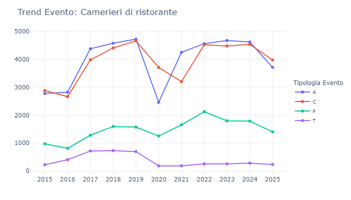
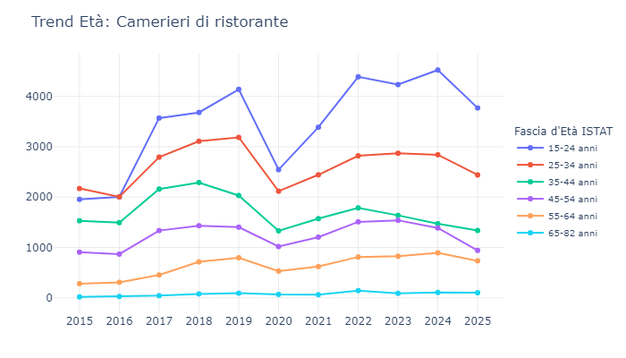
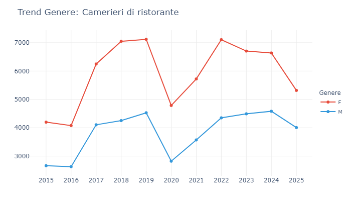
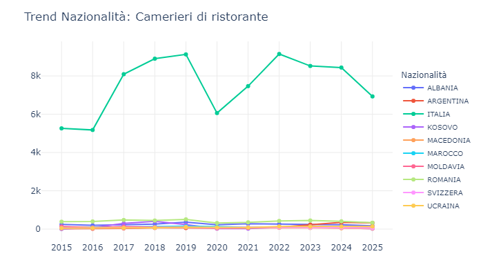
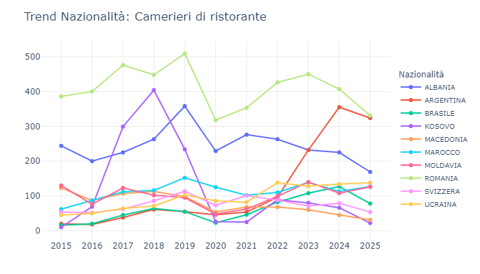
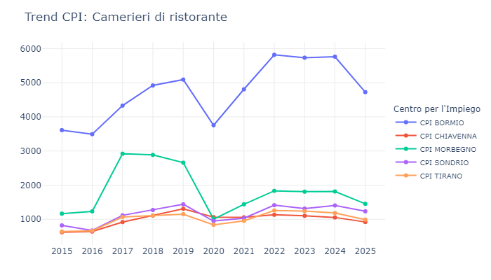

Radiografia di un settore in trasformazione: tra crisi di vocazione, iper-flessibilità e nuove ondate demografiche.

L'osservazione aggregata del mercato offre una lettura stabilizzata delle dinamiche macroeconomiche. È tuttavia isolando specifiche professioni-chiave che si evidenzia la reale orografia occupazionale del territorio. L'analisi della qualifica "Camerieri di ristorante" si rivela un indicatore primario per misurare l'esposizione, la vulnerabilità e le rapide escursioni del comparto turistico e dell'accoglienza (HoReCa: Hotellerie, Restaurant, Café). Il confronto tra le metriche di questa singola mansione e il bacino generale delle Top 25 qualifiche fa emergere dislivelli radicali, delineando una professione attraversata da una profonda e strutturale mutazione.

\
\

## Eventi

::: {.content-visible when-format="html"}
<iframe src="esportazioni_quarto/grafico_6_camerieri_di_ristorante.html" width="100%" height="500px" style="border:none;"></iframe>
:::

::: {.content-visible when-format="pdf"}
{#fig-dettaglio width=100%}
:::

#### Il metabolismo del turnover: fluttuazione e radicamento
Osservando le curve degli Avviamenti (A) e delle Cessazioni (C), emerge la natura "pulsante" del mercato. Nel quadro generale (Top 25 qualifiche), le due linee viaggiano quasi sovrapposte, assorbendo oltre 27.000 ingressi e altrettante uscite nel 2024. Tuttavia, nel focus sui Camerieri di ristorante, questa sovrapposizione è ancora più stretta e simmetrica. Questo andamento a "fisarmonica" certifica che la ristorazione vive di un ricambio totale e continuo: ogni assunzione corrisponde quasi matematicamente a una cessazione a breve termine, evidenziando una fortissima componente stagionale o a chiamata che non si sedimenta mai nella classica occupazione a tempo indeterminato. In questo ecosistema, tuttavia, l'incessante fluttuazione dei contratti prende la forma di una vera e propria **precarietà non disaggregante**, capace di generare una peculiare forma di radicamento ritmico e prevedibile. Il lavoratore non consolida la propria posizione attraverso la stabilità contrattuale standard, bensì ancorandosi alla fisiologica stagionalità del territorio, riattivando il proprio impiego a ogni nuovo ciclo turistico. Questa alternanza costante si trasforma così da sintomo di instabilità a vera spina dorsale dell'economia d'accoglienza, garantendo al comparto un bacino di competenze resiliente e puntuale.

#### L'anomalia del 2020: il salasso della ristorazione
L'impatto della pandemia rivela la diversa fragilità dei settori. Nel mercato generale, gli Avviamenti (A) nel 2020 sono scesi del 26% (da 26.261 a 19.386), mentre le Cessazioni (C) si sono mantenute alte, indicando una perdita di posti di lavoro netta ma non un blocco totale. Nel caso dei Camerieri, lo scenario è drammatico: gli Avviamenti sono letteralmente dimezzati (-48%, crollando da 4.718 a 2.460), mentre le Cessazioni (3.702) hanno superato di gran lunga le assunzioni. È il ritratto grafico di un settore che ha "svuotato la stiva" senza poter imbarcare nessuno per mesi.

#### Il miraggio dell'indeterminato(trasformazioni vs proroghe)
Nel perimetro delle Top 25, le Trasformazioni (T) mantengono un livello costante e strutturato (oltre 3.200 nel 2024), pari al 12% dei nuovi Avviamenti. Per i Camerieri, l'orizzonte si biforca tra pre e post-2020. Fino al 2019, le Trasformazioni abbozzavano una contenuta ma regolare ascesa, lambendo le 700 unità. La frattura del 2020 ha azzerato tale progresso in modo duraturo: da quel momento, la curva delle stabilizzazioni si è appiattita sul livello minimo (286 nel 2024, appena il 6% degli ingressi). In netta contrapposizione, le Proroghe (P) hanno registrato un'impennata strutturale. La divaricazione tra i due indici suggerisce che la pandemia abbia elevato l'iper-flessibilità a norma sistemica: a fronte delle repentine escursioni della domanda, il tessuto imprenditoriale sembra aver rinunciato al consolidamento della mansione, affidandosi sistematicamente allo sbarramento protettivo dei prolungamenti contrattuali. Tuttavia, questa lettura impone cautela: l'effettiva natura delle trasformazioni contrattuali presenta ancora delle zone d'ombra e necessiterà di un ulteriore approfondimento metodologico per decifrarne appieno le reali dinamiche interne.



## Età

::: {.content-visible when-format="html"}
<iframe src="esportazioni_quarto/grafico_12_camerieri_di_ristorante.html" width="100%" height="500px" style="border:none;"></iframe>
:::

::: {.content-visible when-format="pdf"}
{#fig-dettaglio width=100%}
:::

#### L'egemonia della Generazione Z e il "primo approdo"
Nel mercato generale (Top 25), la forza lavoro è matura e ben distribuita: la fascia trainante è storicamente quella dei 25-34 anni (che nel 2024 guida la classifica con 17.647 COB), tallonata dai giovanissimi (15-24 anni) e sorretta da volumi enormi e solidi anche tra i 35-54enni. Quando guardiamo ai Camerieri, la piramide anagrafica si capovolge radicalmente: la fascia 15-24 anni domina in modo assoluto e incontrastato (toccando il picco di 4.524 COB nel 2024), staccando in modo abissale i 25-34enni (fermi a 2.841). La sala del ristorante è, numeri alla mano, il più grande bacino di "primo approdo" per i giovanissimi che si affacciano sul mercato del lavoro, spesso sotto forma di impiego studentesco o stagionale.

#### La flessione anagrafica nelle fasce adulte e l'impatto pandemico
L'osservazione delle coorti più mature restituisce un quadro di fisiologico riassetto. Se nel mercato aggregato le curve dei 35-44enni e dei 45-54enni viaggiano parallele su quote elevate (intorno alle 12.000-13.000 COB annue), a riprova di percorsi lavorativi consolidati, per i Camerieri queste stesse linee si posizionano su livelli strutturalmente inferiori, circoscritte sotto la soglia delle 1.500 attivazioni. Tale dislivello non certifica un esodo improvviso dal settore, bensì un calo tendenziale e fisiologico, su cui ha inevitabilmente inciso l'avvallamento pandemico. Lo shock del 2020 ha infatti agito da acceleratore per le fasce più adulte: di fronte all'incertezza e al congelamento dell'accoglienza, si è registrato un più marcato deflusso della forza lavoro over-30 verso professioni meno esposte e in grado di garantire orari maggiormente conciliabili con le esigenze familiari. Una dinamica che ha progressivamente ridotto il radicamento anagrafico all'interno della qualifica, trasformandola sempre più in un bacino di transito.

#### Il traino giovanile nel recupero post-crisi
L'analisi del recupero post-2020 svela un essenziale mutamento negli assetti: il fisiologico disgelo del comparto è stato alimentato quasi esclusivamente dalla fascia 15-24 anni. Si tratta dell'unica direttrice anagrafica a registrare un'impennata decisa dal 2021, a fronte di una crescita marginale per i segmenti over-25. Esposto all'erosione del personale maturo, il tessuto HoReCa (Hotellerie, Restaurant, Café) ha colmato le scoperture incanalando ampi flussi di forza lavoro giovanile, dotata della massima flessibilità ma priva di specializzazione regressa.



## Genere a confronto

::: {.content-visible when-format="html"}
<iframe src="esportazioni_quarto/grafico_4_COB_SEX_qualifiche_25_cat_contratti_15-25a.html" width="100%" height="500px" style="border:none;"></iframe>
<iframe src="esportazioni_quarto/grafico_4_camerieri_di_ristorante.html" width="100%" height="500px" style="border:none;"></iframe>
:::

::: {.content-visible when-format="pdf"}
{#fig-dettaglio width=100%}
{#fig-dettaglio width=100%}
:::

#### L'effetto "montagne russe" e il cratere del 2020
Il primo dato che salta all'occhio è la diversa reattività agli shock esterni (il Covid nel 2020).
Il Mercato Generale: Nel 2020 il totale delle qualifiche ha subito una flessione evidente, ma "attutita". Le donne sono passate da ~36.200 a ~29.900 (-17%), e gli uomini da ~31.300 a ~24.900 (-20%).
I Camerieri: Qui il colpo è stato devastante, a causa delle chiusure dell'HoReCa (Hotellerie-Restaurant-Café). Le donne sono precipitate da 7.119 a 4.786 (-32%), e gli uomini da 4.528 a 2.821 (-37%). Il grafico specifico mostra una vera e propria "forma a V" molto più profonda e appuntita rispetto al trend generale, dimostrando che questa specifica qualifica è un sismografo perfetto per la salute del settore turistico/ricettivo.

#### La "roccaforte" femminile
Entrambi i grafici mostrano una prevalenza di assunzioni femminili, ma con un'intensità diversa.
Il Mercato Generale: Nel trend aggregato, il gap di genere c'è, ma tende a muoversi in parallelo e, in alcuni anni recenti (come il 2024), le linee si avvicinano (37.445 F contro 32.504 M).
I Camerieri: In questa professione, la spaccatura è strutturale e molto più ampia. Nel picco pre-pandemico (2018-2019) e nel rimbalzo (2022), le donne assunte viaggiano stabilmente sopra quota 7.000, mentre gli uomini faticano a superare quota 4.500. È una professione dove la richiesta (o l'offerta) femminile doppia quasi quella maschile, una proporzione che che non trova esatta corrispondenza nelle altre qualifiche di base..

#### L'arretramento post-2022: segnali di contrazione
Il dato forse più interessante per un'analisi di mercato attuale è quello che succede dopo il grande rimbalzo post-Covid del 2022.
Il Mercato Generale: Dopo il picco del 2022, il mercato globale trova una sua stabilità, creando un plateau. I numeri del 2023 e del 2024 restano altissimi e lineari (quasi 37.500 per le donne e 32.500 per gli uomini).
I Camerieri: La linea dei camerieri si rompe. Dal 2022 in poi, i numeri iniziano a scendere progressivamente (per le donne: da 7.106 nel 2022 a 6.638 nel 2024). Questo scollamento dal trend generale è la "prova su carta" di un fenomeno sociale di cui si parla molto: la crisi di vocazione nel settore della ristorazione. Mentre il mercato del lavoro generale tiene, le attivazioni contrattuali per i camerieri calano, suggerendo una difficoltà strutturale delle imprese nel trovare e trattenere questo specifico personale negli ultimi due anni. (Il calo del 2025 è fisiologico in entrambi i grafici, trattandosi probabilmente di un anno non ancora consolidato o parziale).



## Nazionalità

::: {.content-visible when-format="html"}
<iframe src="esportazioni_quarto/grafico_8_camerieri_di_ristorante.html" width="100%" height="500px" style="border:none;"></iframe>
:::

::: {.content-visible when-format="pdf"}
{#fig-dettaglio width=100%}
:::

*Dettaglio grafico esclusa l'Italia della distribuzione delle nazionalità per la qualifica di Cameriere di ristorante*

::: {.content-visible when-format="html"}
<iframe src="esportazioni_quarto/grafico_8__camerieri_di_ristorante_senza_Italia.html" width="100%" height="500px" style="border:none;"></iframe>
:::

::: {.content-visible when-format="pdf"}
{#fig-dettaglio width=100%}
:::

#### L'erosione del bacino interno
Avendo già assodato la dominanza assoluta della forza lavoro italiana nei volumi complessivi, il focus sui Camerieri ci permette di isolare una dinamica settoriale molto chiara. La curva tricolore in questa specifica professione disegna una "M" perfetta: registra grandi picchi nel 2019 (9.124) e nel rimbalzo post-Covid del 2022 (9.146). Tuttavia, a differenza del mercato del lavoro generale che nel biennio 2023-2024 mantiene una robusta posizione, tra i camerieri italiani si nota una flessione evidente (scendendo a 8.438).I lavoratori locali stanno progressivamente abbandonando questo settore.

#### L'apporto latino-americano: una nuova direttrice
Con le comunità storiche (come Romania e Albania) che mostrano ormai la stessa stanchezza fisiologica del dato italiano, il vuoto di manodopera nei ristoranti viene colmato da una rotta migratoria estremamente specifica. Se nel mercato globale spiccano le crescite di nazionalità asiatiche o nordafricane, il settore HoReCa registra un fenomeno tutto suo, targato Sudamerica e in particolare Argentina. Nel 2015 le comunicazioni per camerieri argentini erano appena 20; nel 2024 sono schizzate a 355 (una crescita vicina al 1700%), trascinando al rialzo anche nazioni come Brasile e Colombia. È l'impronta digitale di una recente ondata demografica che, probabilmente facilitata da affinità linguistiche e culturali, ha trovato proprio nella ristorazione la sua principale porta di ingresso lavorativa. Anche in questo caso, però, sono necessarie altre e più puntuali indagini per capire se si tratti di un fenomeno di breve durata, legato a specifiche dinamiche migratorie, o se invece stiamo assistendo alla formazione di una nuova direttrice strutturale all'interno del mercato del lavoro locale.



## Territorio e CPI

::: {.content-visible when-format="html"}
<iframe src="esportazioni_quarto/grafico_10_camerieri_di_ristorante.html" width="100%" height="500px" style="border:none;"></iframe>
:::

::: {.content-visible when-format="pdf"}
{#fig-dettaglio width=100%}
:::

#### Il ruolo turistico dell'Alta Valle (Bormio)
Nel mercato globale (Top 25), il CPI di Bormio è leader fisiologico con circa 25.000 comunicazioni recenti, ma Morbegno e Sondrio lo seguono a debita distanza (intorno alle 13.000-15.000). Quando però isoliamo i Camerieri, l'egemonia di Bormio diventa schiacciante e fuori scala: con quasi 6.000 COB annue post-Covid, assorbe da solo una fetta enorme dell'intero bacino. Questo polarizza il dato e certifica come l'Alta Valle, trainata dai flussi turistici (termali, sciistici e naturalistici), sia il vero "motore HoReCa" del territorio, dettando i ritmi dell'intera provincia.

#### Sondrio: il capoluogo "amministrativo"
Il posizionamento del CPI di Sondrio risulta particolarmente indicativo. Performante nell'aggregato generale delle professioni, nell'ambito specifico dei camerieri arretra ai livelli minimi, superato da Morbegno e allineato ai volumi di Tirano e Chiavenna (circa 1.300 COB). È l'evidenza di un tessuto urbano profondamente radicato nel terziario amministrativo e commerciale, ma strutturalmente estraneo al rapido torrente di turnover stagionale che caratterizza le aree ad alta vocazione ricettiva.

#### L'anomalia storica di Morbegno
Un altro dettaglio interessante emerge osservando il CPI di Morbegno. Nel mercato generale, a prescindere dalla crisi pandemica, questo centro si posiziona al secondo posto, con volumi stabili e lineari. Tuttavia, nel comparto dei camerieri, la sua curva subisce un'impennata nel biennio 2017-2018 (sfiorando le 3.000 COB), per poi non riprendersi più dopo la crisi. Si tratta di un'anomalia che merita ulteriori approfondimenti, che potrebbe essere legata anche a specifiche dinamiche locali da verificare.

