In questa sezione analizziamo la ripartizione delle attività economiche e delle qualifiche professionali per quanto riguarda il contratto di lavoro in somministrazione nel periodo 2015-2025.

## Le attività economiche - Confronto tra tutti i contratti e il lavoro in somministrazione - Volumi complessivi

#### Il contratto di somministrazione: la flessibilità che rafforza la stabilità
I dati sulle Comunicazioni Obbligatorie in provincia di Sondrio (2015-2025) delineano un mercato del lavoro fortemente orientato alla flessibilità. Il "lavoro interinale" (somministrazione) si posiziona come la terza tipologia contrattuale più utilizzata, con 123.263 comunicazioni, pari all'11,8% del totale.
Questo dato è significativo se confrontato con i due pilastri dell'occupazione locale: il lavoro a tempo determinato, che domina incontrastato con oltre mezzo milione di COB (53,1%), e il tempo indeterminato, al secondo posto con 147.830 (14,2%).
Il divario ridotto tra contratti stabili e somministrazione dimostra come l'interinale sia ormai uno strumento strutturale per le imprese locali, distaccando nettamente il lavoro intermittente (8,1%).

::: {.content-visible when-format="html"}
<iframe src="esportazioni_quarto/grafico_1_COB_tipologia_contratti_interinale.html" width="100%" height="800px" style="border:none;"></iframe>
:::

::: {.content-visible when-format="pdf"}
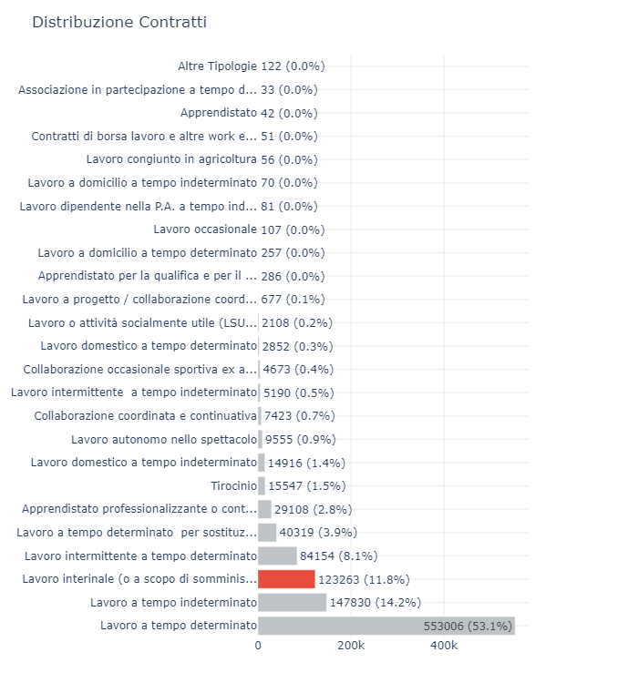{#fig-contratti width=100%}
:::



#### I 25 settori ATECO più trainanti per il lavoro in somministrazione a confronto con tutti i contratti

Il primo grafico rappresenta la distribuzione delle COB di tutti i contratti fra le attività economiche più importanti (Top 25), mentre il secondo la medesima distribuzione di attività economiche solo nelle COB relative ai contratti interinali, o lavoro ‘in somministrazione’.

#### Su tutti i contratti: il dominio del terziario
::: {.content-visible when-format="html"}
<iframe src="esportazioni_quarto/grafico_2_COB_tutti_contratti_ateco.html" width="100%" height="850px" style="border:none;"></iframe>



#### Solo per il lavoro in somministrazione: l'egemonia dell'industria
<iframe src="esportazioni_quarto/grafico_2_COB_interinale_ateco_25.html" width="100%" height="850px" style="border:none;"></iframe>
:::

::: {.content-visible when-format="pdf"}
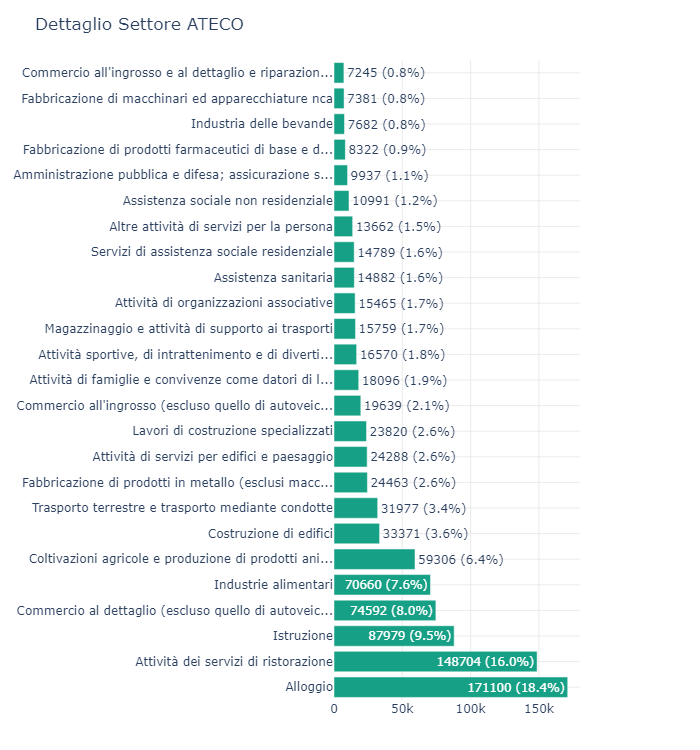{#fig-contratti width=100%}



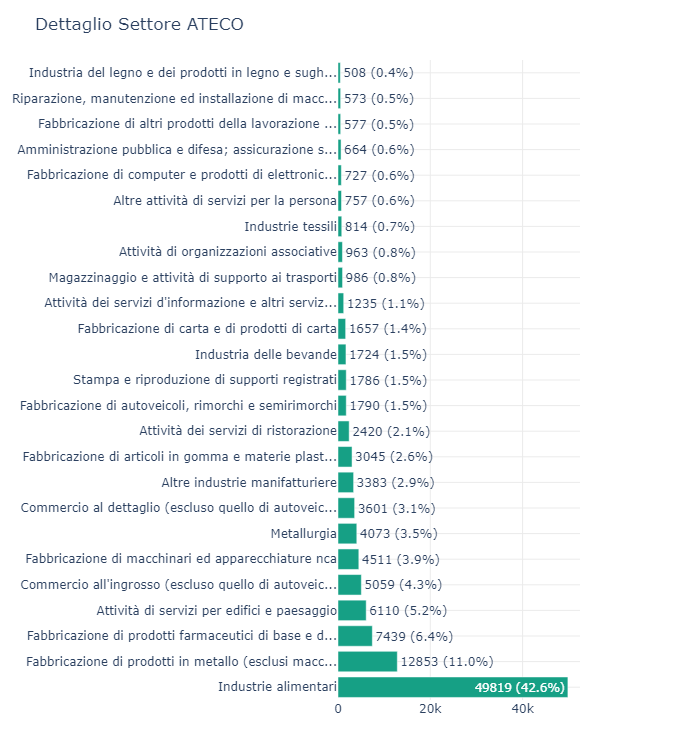{#fig-contratti width=100%}
:::



#### Due ecosistemi a confronto
Il confronto tra la distribuzione generale delle Comunicazioni Obbligatorie (COB) e quella specifica relativa ai contratti in somministrazione offre una radiografia estremamente nitida delle dinamiche del mercato del lavoro locale. L'analisi non mostra semplicemente due sottoinsiemi di dati, ma svela l'esistenza di due ecosistemi organizzativi che utilizzano leve amministrative profondamente diverse per gestire l'elasticità lavorativa. È fondamentale ricordare che i volumi esposti non quantificano i soli avviamenti, bensì la totalità degli eventi burocratici (attivazioni, proroghe, cessazioni e trasformazioni) generati nell'arco del decennio, misurando di fatto l'intensità complessiva del metabolismo amministrativo delle imprese.

#### Il perimetro generale: la trazione del terziario e l'intermediazione diretta
La mappatura complessiva dei flussi delinea un tessuto produttivo a spiccata vocazione terziaria, guidato dai comparti dell'accoglienza. Le attività di "Alloggio" (18,4%) e "Ristorazione" (16,0%) convogliano oltre un terzo (34,4%) dell'intero volume di movimentazioni provinciali, seguite da Istruzione (9,5%) e Commercio (8,0%). L'industria manifatturiera emerge unicamente in quinta posizione con la filiera Alimentare (7,6%). Tale assetto riflette un'alta volatilità stagionale: le imprese di servizio optano per un'internalizzazione della gestione contrattuale, assorbendo i picchi operativi attraverso rapporti diretti a termine e minimizzando il ricorso al brokeraggio esterno.

#### La specializzazione manifatturiera: la centralità della filiera alimentare
Il secondo grafico, focalizzato esclusivamente sulla somministrazione, capovolge radicalmente questa prospettiva, spostando il baricentro in modo massiccio dal settore terziario a quello secondario. Nel perimetro interinale, l'impatto burocratico del turismo diviene marginale: la ristorazione flette al 2,1% e le attività di alloggio escono dalle posizioni di vertice, lasciando il campo a un'egemonia manifatturiera.
Il fenomeno centrale è rappresentato dalle "Industrie alimentari", che accentrano ben il 42,6% di tutte le COB interinali, sfiorando le 50.000 movimentazioni. Questa eccezionale densità amministrativa indica che le aziende di trasformazione dipendono strutturalmente dalle agenzie per la gestione modulare della manodopera. Seguono i segmenti a maggiore intensità di capitale: lavorazione metalli (11,0%), chimico-farmaceutico (6,4%) e meccatronica (3,9%). L'unica voce non strettamente industriale ai vertici del comparto è il facility management ("Attività di servizi per edifici e paesaggio", 5,2%), storicamente soggetto a processi di esternalizzazione.

#### Strategie aziendali: stagionalità contro picchi produttivi
Dal confronto diretto emergono spunti di riflessione cruciali sulle strategie di cost management delle imprese. Se il terziario gestisce la propria varianza in via diretta, l'industria appalta la flessibilità all'esterno generando volumi altissimi di eventi (soprattutto rinnovi). Nel manifatturiero, i picchi operativi non sono dettati dal calendario, ma dall'acquisizione di nuove commesse, dai cicli di export o dall'approvvigionamento di materie prime (fattore critico nell'alimentare). Le agenzie offrono un polmone di risorse pre-selezionate, consentendo di calibrare rapidamente la capacità produttiva e alleggerendo l'impresa dagli oneri e dai rischi legati alle fluttuazioni di mercato.

#### In sintesi 
I dati dimostrano in modo inequivocabile che la somministrazione non costituisce uno strumento di flessibilità utilizzato trasversalmente da tutta l'economia. Al contrario, si configura come un dispositivo su misura, quasi esclusivo, per la supply chain industriale e manifatturiera. Mentre i servizi alla persona, il commercio e il turismo muovono i grandi volumi del turnover provinciale tramite rapporti diretti, il vero motore burocratico dell'interinale opera in stretta correlazione con i cicli di saturazione delle linee di montaggio.
I dati dimostrano in modo inequivocabile che il lavoro interinale non è uno strumento di flessibilità utilizzato trasversalmente da tutta l'economia. Al contrario, si configura come una soluzione su misura, quasi esclusiva, per le necessità del settore industriale e manifatturiero. Mentre i servizi alla persona, il commercio e il turismo muovono i grandi volumi del mercato del lavoro tramite rapporti diretti, il vero "motore" della somministrazione batte esclusivamente al ritmo delle catene di montaggio.

## Genere - Confronto tra tutti i contratti e il lavoro in somministrazione - Volumi complessivi

#### Due modelli di flessibilità: l'impatto di genere
L'analisi temporale dal 2015 al 2025 delle Comunicazioni Obbligatorie (COB) in provincia di Sondrio rivela come la flessibilità lavorativa non sia "neutra" rispetto al genere, ma assuma connotati profondamente diversi a seconda dello strumento contrattuale utilizzato. Il confronto tra la curva del mercato del lavoro generale e quella specifica del lavoro in somministrazione (interinale) mette in luce una stratificazione strutturale che modella opportunità e precarietà in base al sesso dei lavoratori.

##### Genere sulla totalità dei contratti

::: {.content-visible when-format="html"}
<iframe src="esportazioni_quarto/grafico_3COB_sex_tutti_contratti.html" width="100%" height="450px" style="border:none;"></iframe>
:::

::: {.content-visible when-format="pdf"}
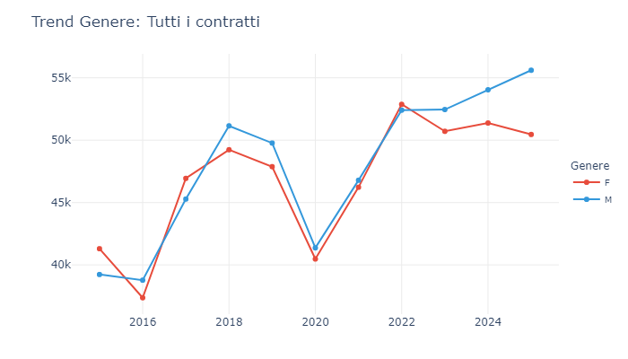{#fig-genere-totale width=60% fig-pos="H"}
:::

##### Genere solo per il lavoro in somministrazione

::: {.content-visible when-format="html"}
<iframe src="esportazioni_quarto/grafico_4_COB_SEX_interinale_ateco_25.html" width="100%" height="450px" style="border:none;"></iframe>
:::

::: {.content-visible when-format="pdf"}
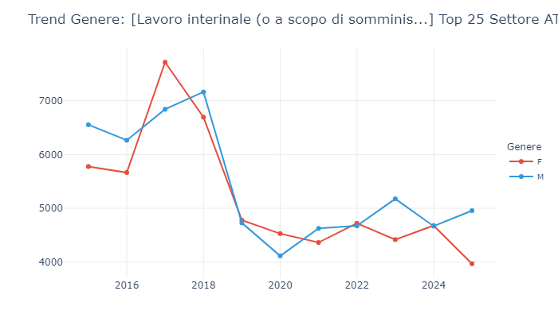{#fig-genere-somministrazione width=100% fig-pos="H"}
:::

#### Il mercato generale: dalla parità alla "forbice" recente
Il primo grafico, che fotografa il totale delle movimentazioni registrate indipendentemente dalla tipologia, descrive un decennio in cui il turnover ha inizialmente coinvolto entrambi i generi in misura quasi paritetica. Fino al 2017, infatti, le curve maschili e femminili si muovono vicine, con i flussi femminili in leggero vantaggio (oltre 41.300 comunicazioni nel 2015 contro le 39.232 maschili). Entrambe le linee subiscono il drammatico e simmetrico crollo pandemico del 2020 — precipitando attorno a quota 40.000 — a causa del congelamento del turismo e del commercio, settori ad alta intensità di manodopera mista. La vera anomalia del mercato generale si manifesta nel post-Covid. Dal 2023 assistiamo all'apertura di una netta "forbice": mentre le movimentazioni femminili si stabilizzano per poi flettere nel 2025 (50.460 COB), i flussi maschili continuano a crescere senza sosta, toccando il record storico di oltre 55.600 eventi nell'ultimo anno rilevato.

#### Il lavoro interinale: una roccaforte strutturalmente maschile
Spostando lo sguardo sul secondo grafico, relativo al solo lavoro interinale, lo scenario numerico e strutturale cambia radicalmente. Qui i volumi sono inevitabilmente molto più bassi, ma le dinamiche di genere sono marcate e croniche. Nel decennio osservato, la curva maschile (blu) si mantiene costantemente al di sopra di quella femminile (rossa) in quasi tutte le annualità, con una sola anomala inversione nel 2017. Come evidenziato in precedenza, l'interinale in questo territorio è il "motore" dell'industria pesante, della trasformazione alimentare e della logistica. Trattandosi di comparti dove l'occupazione operativa è storicamente a forte trazione maschile, la curva maschile domina. Nel 2018, ad esempio, le COB interinali maschili superano quota 7.100, contro le 6.600 femminili.

#### Le dinamiche del turnover e l'effetto pandemico
Questa divergenza nei volumi assoluti ci racconta anche una storia di diversa sensibilità agli shock. Il crollo del 2020 colpisce duramente anche l'interinale, ma in modo asimmetrico: gli eventi burocratici maschili crollano drasticamente da oltre 7.100 a poco più di 4.100. Questo tonfo così verticale dimostra come la componente maschile dell'interinale fosse legata a filiere industriali o logistiche che si sono bruscamente arrestate o hanno tagliato immediatamente i contratti più flessibili. Sorprendentemente, la curva femminile dell'interinale nel 2020 flette in modo molto più dolce, scendendo a circa 4.500 unità (superando persino i flussi maschili in quell'anno). Questo suggerisce che le mansioni presidiate dalla somministrazione femminile fossero collocate in settori considerati "essenziali" (come alcune specifiche linee alimentari o servizi di pulizia) che non si sono fermati durante il lockdown.

#### La ripresa post-Covid: precarietà e volumi
Nel periodo post-pandemico (2021-2025), il grafico dell'interinale mostra una stabilizzazione su volumi inferiori rispetto al pre-2018. Tuttavia, la curva maschile riprende a salire negli ultimi anni, staccando nuovamente quella femminile (quasi 5.000 COB maschili contro le meno di 4.000 femminili nel 2025). Questo trend, seppur su scala ridotta, ricalca l'apertura della "forbice" vista nel grafico generale, suggerendo una recente ripresa manifatturiera che assorbe principalmente manodopera maschile tramite agenzia.

#### In sintesi
Il confronto tra i due trend conferma che la forma contrattuale riflette precise scelte organizzative e divisioni di genere. Mentre il mercato generale è sostenuto dai grandi numeri di un terziario che assorbe entrambi i sessi (ma che ultimamente alimenta maggiori flussi maschili), il lavoro interinale si conferma una corsia preferenziale per la flessibilità industriale, alimentando un turnover storicamente sbilanciato a favore della componente maschile.



## Eventi - Confronto tra tutti i contratti e il lavoro in somministrazione - Volumi complessivi

#### Le dinamiche degli eventi: turnover fisiologico contro flessibilità estrema
L'analisi degli "Eventi" delle Comunicazioni Obbligatorie (COB) — ovvero Avviamenti (A), Cessazioni (C), Proroghe (P) e Trasformazioni (T) — costituisce la vera cartina di tornasole per comprendere come le aziende gestiscono il ciclo di vita dei lavoratori. Il confronto tra il mercato del lavoro generale e il sottoinsieme del lavoro interinale (somministrazione) svela due modelli di gestione delle risorse umane radicalmente opposti, evidenziati da un clamoroso ribaltamento delle gerarchie tra le linee dei due grafici.

##### Eventi sulla totalità dei contratti

::: {.content-visible when-format="html"}
<iframe src="esportazioni_quarto/grafico_5_COB_EVENTI_tipologia_contratti_15-25a.html" width="100%" height="450px" style="border:none;"></iframe>
:::

::: {.content-visible when-format="pdf"}
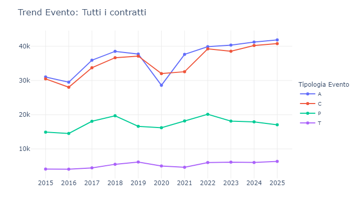{#fig-eventi-totale width=60% fig-pos="H"}
:::

##### Eventi solo per il lavoro in somministrazione

::: {.content-visible when-format="html"}
<iframe src="esportazioni_quarto/grafico_6_COB_EVENTI_interinale_ateco_25.html" width="100%" height="450px" style="border:none;"></iframe>
:::

::: {.content-visible when-format="pdf"}
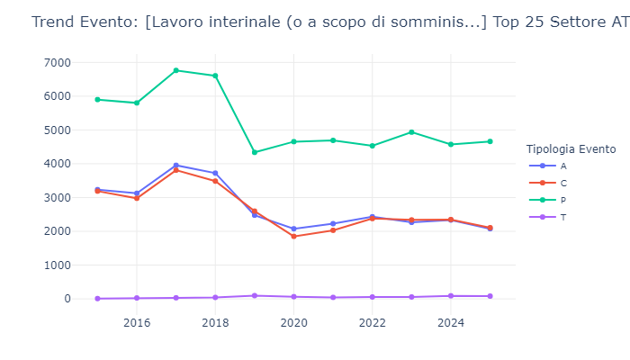{#fig-eventi-somministrazione width=100% fig-pos="H"}
:::

#### Il mercato generale: il fisiologico dominio del turnover (A e C)
Nel primo grafico, che descrive l'intero mercato del lavoro provinciale, la gerarchia degli eventi è quella canonica di un'economia vivace e a forte trazione stagionale (come visto per turismo e agricoltura). Le curve dominanti sono quelle degli Avviamenti (blu) e delle Cessazioni (rossa), che viaggiano in parallelo su volumi altissimi, partendo da circa 30.000 eventi nel 2015 per superare quota 40.000 nel 2025. Questo parallelismo quasi perfetto indica un turnover fisiologico e continuo: a ogni assunzione (spesso a tempo determinato) corrisponde, mesi dopo, una fisiologica scadenza. È interessante notare l'anomalia del 2020: l'unico anno in cui le Cessazioni (32.018) superano gli Avviamenti (28.604), a testimonianza del blocco delle assunzioni e del mancato rinnovo dei contratti a termine causato dallo shock pandemico. Le Proroghe (verde), pur importanti (tra i 15.000 e i 20.000 eventi annui), rimangono un fenomeno secondario rispetto alla creazione e chiusura di nuovi rapporti di lavoro.

#### Il lavoro interinale: l'anomalia strutturale delle proroghe (P)
Osservando il secondo grafico, relativo ai soli contratti in somministrazione, si assiste a un totale capovolgimento del paradigma. La curva dominante non è più quella degli Avviamenti, bensì quella delle Proroghe (verde). Per quasi tutto il decennio (con picchi vicini ai 6.700 eventi nel 2017), il numero di proroghe supera nettamente sia le nuove assunzioni (blu) che le cessazioni (rossa). Questa inversione gerarchica è la firma inequivocabile della precarietà "strutturata" tipica dell'interinale. Matematicamente, potrebbe significare che un singolo lavoratore in somministrazione genera un solo Avviamento iniziale, ma il suo contratto viene poi prolungato artificialmente attraverso molteplici rinnovi di brevissima durata (spesso mensili o addirittura settimanali), generando una cascata di Proroghe, prima di arrivare all'inevitabile singola Cessazione finale. L'industria e la logistica usano la somministrazione non tanto per il ricambio continuo di persone diverse (turnover), ma per mantenere le stesse persone in uno stato di perenne provvisorietà burocratica.

#### Le trasformazioni (T): il grande assente nella somministrazione
Una terza, marcatissima differenza risiede nella curva delle Trasformazioni (viola), ovvero il passaggio da contratti precari a contratti stabili (es. da tempo determinato a indeterminato). Nel mercato generale, questa curva mostra una presenza solida e in lieve crescita (da 4.000 a oltre 6.300 eventi nel 2025), segno che una quota fisiologica di lavoratori a termine viene infine stabilizzata dalle aziende. Nel grafico dell'interinale, la linea viola è letteralmente schiacciata sullo zero (oscillando tra 9 e 97 eventi in tutto il decennio). Questo accade per una precisa dinamica normativa e di mercato: le agenzie interinali quasi mai "trasformano" a tempo indeterminato i propri somministrati anche se è un fenomeno che si verifica ed è in aumento, come testimoniato dagli studi più recenti. Quando un'azienda utilizzatrice decide di stabilizzare un lavoratore interinale, non c'è una "Trasformazione" interna all'agenzia, ma una "Cessazione" del contratto di somministrazione seguita da un nuovo "Avviamento" diretto presso l'azienda finale.

#### In sintesi
I due grafici confermano che stiamo osservando due ecosistemi differenti. Il mercato generale usa Avviamenti e Cessazioni per assecondare i cicli naturali e stagionali dell'economia locale, stabilizzando una parte della forza lavoro nel tempo. Il lavoro interinale, invece, è uno strumento di estrema "micro-flessibilità", in cui le assunzioni reali sono poche rispetto a una mole sproporzionata di Proroghe, disegnando un sistema in cui la precarietà viene reiterata nel breve e brevissimo periodo senza sfociare quasi mai in una stabilizzazione diretta tramite lo stesso canale.



## Nazionalità - Confronto tra tutti i contratti e il lavoro in somministrazione - Volumi complessivi

##### Nazionalità sulla totalità dei contratti

::: {.content-visible when-format="html"}
<iframe src="esportazioni_quarto/grafico_7_COB_NAZ_Tutti_contr_1525_solo_10_naz.html" width="100%" height="450px" style="border:none;"></iframe>
:::

::: {.content-visible when-format="pdf"}
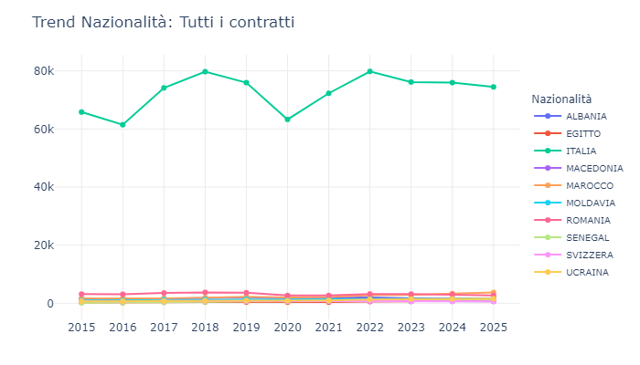{#fig-nazionalita-totale width=60% fig-pos="H"}
:::

##### Nazionalità solo per il lavoro in somministrazione

::: {.content-visible when-format="html"}
<iframe src="esportazioni_quarto/grafico_8_COB_NAZ_10_interinale_ateco_25.html" width="100%" height="450px" style="border:none;"></iframe>
:::

::: {.content-visible when-format="pdf"}
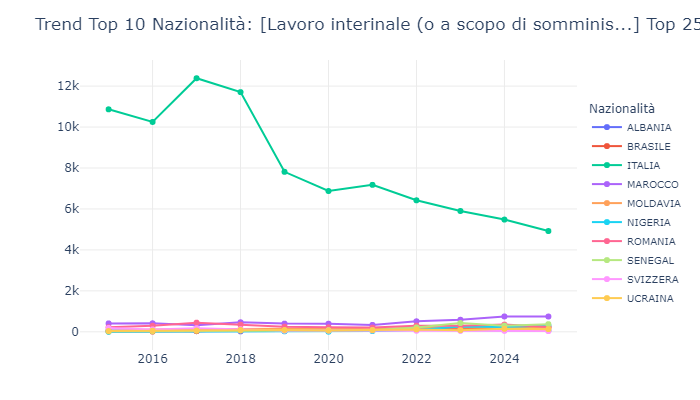{#fig-nazionalita-somministrazione width=100% fig-pos="H"}
:::

#### Nazionalità e flessibilità: l'effetto sostituzione nel lavoro interinale, un mercato etnicamente stratificato
L'analisi della distribuzione delle nazionalità all'interno delle Comunicazioni Obbligatorie (COB) offre una chiave di lettura fondamentale per comprendere le dinamiche demografiche del mercato del lavoro locale. Confrontando il bacino generale delle movimentazioni con lo spaccato relativo al solo lavoro interinale (somministrazione), non emerge solo una differenza di volumi, ma un vero e proprio "effetto sostituzione" in corso, caratterizzato da una drammatica fuga della manodopera locale e dall'ingresso di nuove ondate migratorie nei flussi amministrativi.

#### Il mercato generale: il blocco storico
Il primo grafico, che descrive la totalità delle comunicazioni registrate, delinea un mercato in cui la componente italiana fa la parte del leone, mantenendo un volume solido e costante (tra le 65.000 e le 79.000 comunicazioni annue). Alle spalle del bacino locale, si consolida il "blocco storico" dell'immigrazione in provincia: Romania, Marocco, Albania e Moldavia. Nel mercato generale, queste nazionalità mostrano curve stabili o in crescita fisiologica, perfettamente integrate nei settori trainanti dell'economia locale come il turismo, l'edilizia e l'agricoltura, dove spesso generano eventi a tempo determinato diretti.

#### La contrazione burocratica della componente interna
Spostando il focus sul secondo grafico, relativo esclusivamente al lavoro interinale applicato ai settori ATECO più rilevanti (che sappiamo essere a forte trazione industriale e logistica), l'andamento della linea verde (Italia) rappresenta il dato più dirompente dell'intera analisi. Se nel 2017 il bacino della manodopera italiana in somministrazione generava un volume di oltre 12.300 eventi, nel 2025 questo carico amministrativo è letteralmente precipitato a 4.922 COB. Si tratta di un crollo strutturale, netto e continuo, che non ha eguali nel mercato generale. Questo svuotamento indica una progressiva, e apparentemente inarrestabile, disaffezione della manodopera locale verso lo strumento dell'interinale: i lavoratori italiani, probabilmente alla ricerca di maggiore stabilità o ricollocati in settori terziari a minore pressione fisica, stanno abbandonando i flussi di somministrazione legati all'industria meccanica e alle linee ad alto logoramento della trasformazione alimentare.

#### L'avanzata del continente africano
Vediamo nel dettaglio i grafici escludendo l'Italia, che rappresenta la nazionalità con la maggiore incidenza e che inclusa rende graficamente quasi invisibili i volumi delle altre etnie.

##### Nazionalità sulla totalità dei contratti senza l'Italia

::: {.content-visible when-format="html"}
<iframe src="esportazioni_quarto/grafico_7_COB_NAZ_Tutti_contr_1525_solo_10_naz_senza_Italia.html" width="100%" height="450px" style="border:none;"></iframe>
:::

::: {.content-visible when-format="pdf"}
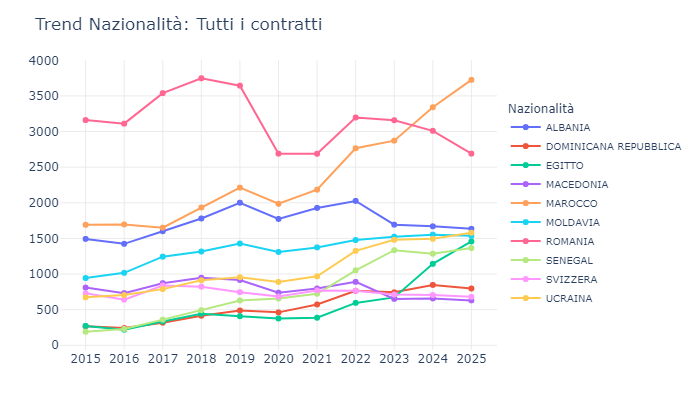{#fig-nazionalita-totale-senza-ITA width=60% fig-pos="H"}
:::

##### Nazionalità solo per il lavoro in somministrazione senza l'Italia

::: {.content-visible when-format="html"}
<iframe src="esportazioni_quarto/grafico_8_COB_NAZ_10_interinale_ateco_25_senza_Italia.html" width="100%" height="450px" style="border:none;"></iframe>
:::

::: {.content-visible when-format="pdf"}
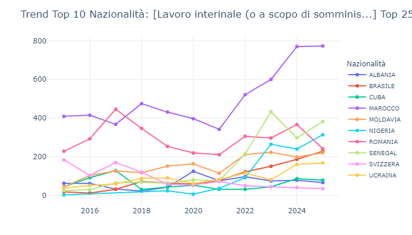{#fig-nazionalita-somministrazione-senza-ITA width=100% fig-pos="H"}
:::

A fronte di un'industria che continua ad avere un bisogno vitale di estrema flessibilità e di un costante fabbisogno di risorse per le turnazioni più gravose, lo spazio burocratico lasciato vuoto dagli italiani è stato rapidamente colmato da nuove geografie. Il secondo grafico mostra infatti l'impennata delle movimentazioni di specifiche nazionalità del continente africano. Il Marocco (linea viola) raddoppia la propria incidenza burocratica, passando da meno di 400 eventi a 747. Ma sono le curve di Senegal e Nigeria a descrivere l'impatto più esplosivo: il Senegal passa da appena 25 movimentazioni nel 2015 a 374 nel 2025, mentre la Nigeria, la cui incidenza era praticamente assente fino al 2018, schizza a oltre 300 pratiche interinali negli ultimi anni. La somministrazione, con le sue basse barriere all'ingresso fornite dalle agenzie, si è trasformata nel principale canale di reclutamento per l'inserimento operativo delle ondate migratorie più recenti.

#### Il "pianoro" dell'Est Europa
È altrettanto interessante notare chi non sta sostituendo gli italiani nei flussi interinali. Le nazionalità dell'Est Europa, storicamente fortissime in provincia, mostrano curve piatte o in declino nel secondo grafico. La Romania, seconda forza assoluta nel mercato generale, nell'interinale oscilla su volumi amministrativi bassi (200-300 eventi) con una tendenza al ribasso. L'Albania e la Moldavia seguono dinamiche simili, quasi schiacciate sul fondo del grafico. Questo suggerisce che queste comunità, ormai storicamente radicate nel territorio, abbiano completato il proprio percorso di stabilizzazione, affrancandosi dalla precarietà del brokeraggio di agenzia per transitare verso assunzioni dirette o verso il lavoro autonomo.

#### In sintesi
Il confronto tra i due grafici certifica una profonda stratificazione etnica del grado di precarietà. Mentre il mercato del lavoro generale mantiene una sua stabilità strutturale guidata dal bacino italiano, l'ecosistema dell'interinale industriale si sta svuotando della componente locale. Il "lavoro in affitto" sta diventando un segmento caratterizzato da una progressiva internazionalizzazione, in cui la massima flessibilità richiesta per la saturazione degli impianti viene scaricata e assorbita sempre di più, in termini di volumi burocratici, dai flussi di manodopera straniera di più recente immigrazione.



## CPI - Confronto tra tutti i contratti e il lavoro in somministrazione - Volumi complessivi

##### CPI sulla totalità dei contratti

::: {.content-visible when-format="html"}
<iframe src="esportazioni_quarto/grafico_9_COB_CPI_tutti_contratti_1525.html" width="100%" height="450px" style="border:none;"></iframe>
:::

::: {.content-visible when-format="pdf"}
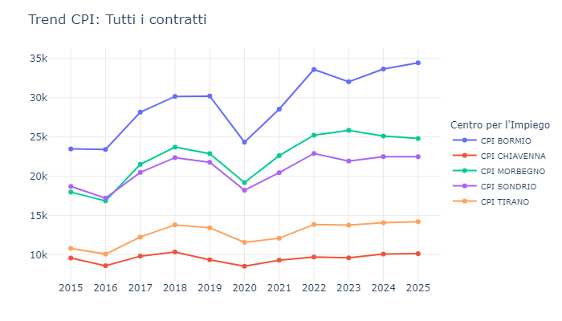{#fig-CPI-totale width=60% fig-pos="H"}
:::

##### CPI solo per il lavoro in somministrazione

::: {.content-visible when-format="html"}
<iframe src="esportazioni_quarto/grafico_10_COB_CPI_interinale_ateco_25.html" width="100%" height="450px" style="border:none;"></iframe>
:::

::: {.content-visible when-format="pdf"}
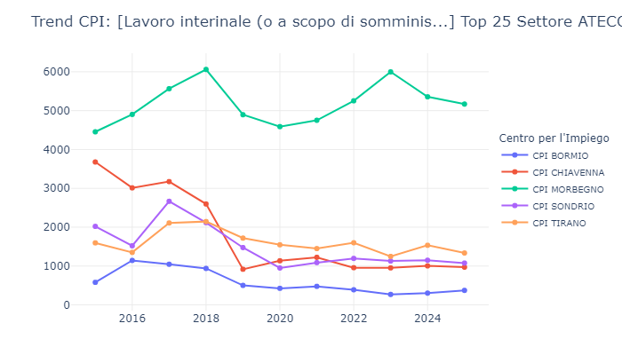{#fig-CPI-somministrazione width=100% fig-pos="H"}
:::

#### Geografia della flessibilità: la polarizzazione territoriale dei modelli operativi
L'analisi della distribuzione territoriale delle Comunicazioni Obbligatorie (COB) attraverso i Centri per l'Impiego (CPI) della provincia di Sondrio fornisce un elemento di valutazione essenziale per la comprensione del mercato del lavoro locale. Confrontando il bacino generale delle movimentazioni con quello specifico del lavoro interinale (somministrazione), si osserva una sostanziale inversione della distribuzione geografia provinciale. Il territorio evidenzia una netta dicotomia tra due modelli produttivi distinti, dove l'elasticità organizzativa viene gestita con strumenti differenti a seconda della vocazione dell'area.

#### Il mercato generale: la prevalenza dei flussi turistici in Alta Valle
Il primo grafico, relativo alla totalità delle comunicazioni registrate, evidenzia un assetto territoriale consolidato, con una spiccata concentrazione nel CPI di Bormio. I flussi dell'Alta Valtellina si mantengono stabilmente sui valori massimi, passando da 23.470 comunicazioni nel 2015 a oltre 34.000 eventi nel 2025. Alle sue spalle si posizionano Morbegno (in decisa ascesa fino a 24.800) e il capoluogo Sondrio (stabile sui 22.000), mentre chiudono i bacini di Tirano e Chiavenna. Questa distribuzione riflette l'impatto del settore turistico: l'area di Bormio e Livigno, caratterizzata da un'elevata stagionalità invernale ed estiva, genera un volume cospicuo di eventi a tempo determinato diretti. Nel mercato generale, le volumetrie burocratiche appaiono strettamente correlate alle dinamiche dei servizi ricettivi.

#### La concentrazione dell'interinale: il polo manifatturiero di Morbegno
Spostando l'attenzione sul secondo grafico, focalizzato esclusivamente sulla somministrazione, la distribuzione territoriale subisce una profonda rimodulazione. Il bacino di Morbegno, posizionato al secondo posto nei flussi generali, assume una posizione di netto rilievo per l'intero decennio, sfiorando i 6.000 eventi in somministrazione nel 2023. Tale primato conferma su scala geografica le evidenze dell'analisi settoriale: l'interinale costituisce lo strumento primario per il comparto manifatturiero e alimentare. La Bassa Valtellina (competenza del CPI di Morbegno) rappresenta storicamente il fulcro industriale della provincia; la presenza di stabilimenti di trasformazione alimentare e imprese metalmeccaniche impone un ricorso strutturale alle agenzie per la gestione dei picchi produttivi, consolidando l'area quale epicentro provinciale della somministrazione.

#### La flessione di Bormio: la marginalità dell'intermediazione ricettiva
Il dato di maggiore discontinuità del secondo grafico è tuttavia la marcata flessione del CPI di Bormio. Il bacino principale del mercato generale si posiziona sul livello minimo nella somministrazione, con la linea blu che si appiattisce sul fondo del grafico, passando dai già modesti 1.144 eventi del 2016 a una quota residuale di 373 comunicazioni nel 2025. Questa contrazione evidenzia una specifica dinamica organizzativa: il settore turistico-ricettivo ricorre in misura marginale alle agenzie per il lavoro. Pur necessitando di elevato turnover e flessibilità, le imprese dell'Alta Valle prediligono la gestione diretta del reclutamento stagionale, rendendo l'istituto della somministrazione un fattore statisticamente secondario in quel territorio.

#### Le dinamiche secondarie: il ridimensionamento di Chiavenna
Merita menzione l'andamento del CPI di Chiavenna nel segmento interinale. Nel triennio 2015-2017, la linea rossa mostrava volumi significativi (oltre 3.000 movimentazioni), posizionandosi a ridosso di Morbegno. A partire dal 2018 si registra tuttavia una contrazione strutturale che riporta Chiavenna sotto quota 1.000, allineandola ai volumi di Sondrio e Tirano. Questa flessione suggerisce una possibile rimodulazione o un cambio di strategia contrattuale da parte di specifiche realtà industriali attive in Valchiavenna nel periodo in esame.

#### Sintesi territoriale
I dati confermano l'assenza di un unico modello di gestione della flessibilità. La provincia è caratterizzata da una netta polarizzazione: da un lato l'Alta Valle (Bormio), che registra elevati volumi di eventi stagionali diretti trainati dai servizi e dall'accoglienza; dall'altro la Bassa Valle (Morbegno), che sostiene l'operatività manifatturiera affidando la propria flessibilità organizzativa al supporto delle agenzie di somministrazione.



## Età - Confronto tra tutti i contratti e il lavoro in somministrazione - Volumi complessivi

##### Età sulla totalità dei contratti

::: {.content-visible when-format="html"}
<iframe src="esportazioni_quarto/grafico_11_COB_ETA_ISTAT_tutti_contratti_1525.html" width="100%" height="450px" style="border:none;"></iframe>
:::

::: {.content-visible when-format="pdf"}
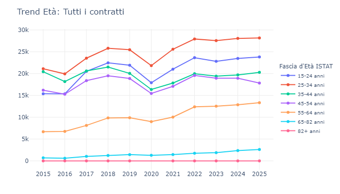{#fig-Eta-totale width=60% fig-pos="H"}
:::

##### Età solo per il lavoro in somministrazione

::: {.content-visible when-format="html"}
<iframe src="esportazioni_quarto/grafico_12_COB_ETA_ISTAT_interinale_ateco_25.html" width="100%" height="450px" style="border:none;"></iframe>
:::

::: {.content-visible when-format="pdf"}
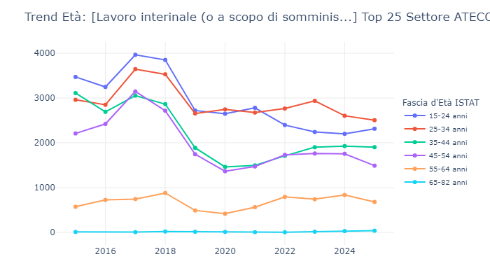{#fig-Eta-somministrazione width=100% fig-pos="H"}
:::

#### Demografia e flessibilità: l'impatto degli shock normativi
L'analisi per coorti di età del volume totale delle Comunicazioni Obbligatorie (COB) in provincia di Sondrio impone una lettura integrata che consideri l'evoluzione del quadro legislativo. Il confronto tra il mercato generale e il sottoinsieme della somministrazione indica che le imprese generano eventi burocratici su una composizione anagrafica sostanzialmente analoga in entrambi i bacini. È tuttavia la reattività agli interventi normativi nel corso del decennio a tracciare una linea di demarcazione netta tra i due modelli a confronto.

##### Gerarchie parallele: l'omogeneità della base demografica
I due grafici condividono la medesima base demografica. In entrambi i casi, le coorti che generano il maggior volume di COB sono quelle dei 25-34enni (linea rossa) e della fascia 15-24 (linea blu), seguite dal segmento 35-44 (linea verde). Nel triennio di massima espansione (2016-2018), le curve principali della somministrazione (dai 15 ai 54 anni) mostrano un andamento omogeneo e ravvicinato. Nel 2017, la fascia dei 45-54enni tocca il proprio valore massimo con 3.146 comunicazioni. Questo dato indica che nei cicli di espansione produttiva, l'industria manifatturiera ha coinvolto tramite agenzia anche fasce di lavoratori maturi, generando elevati volumi di eventi (prevalentemente rinnovi) e confermando l'utilizzo della somministrazione quale strumento di flessibilità trasversale per l'operatività aziendale.

##### L'analisi temporale: la flessione del 2019 e il fattore regolatorio
La divergenza principale tra i due grafici emerge analizzando la volatilità delle curve sull'asse temporale. Il mercato generale (primo grafico) descrive linee più lineari e progressive, caratterizzate da una crescita costante degli eventi fino al 2018, una tenuta nel 2019 e la successiva, prevedibile contrazione pandemica del 2020. I flussi in somministrazione (secondo grafico) registrano invece un marcato ridimensionamento anticipato nel 2019. Tale flessione non appare legata a dinamiche macroeconomiche, ma è riconducibile all'entrata in vigore del "Decreto Dignità" (L. 96/2018). La riforma ha introdotto parametri restrittivi per la somministrazione, riducendo la durata massima, limitando il numero di proroghe consentite e reintroducendo l'obbligo di causali. Il provvedimento ha inciso direttamente sul moltiplicatore burocratico del settore: le imprese, impossibilitate a reiterare rinnovi di breve durata senza esporsi a criticità di conformità, hanno operato una razionalizzazione dei flussi. La riduzione di migliaia di COB nel 2019 costituisce l'effetto amministrativo di tale intervento.

##### La ricomposizione anagrafica: il riposizionamento sui profili intermedi
All'interno di questa dinamica normativa, il grafico evidenzia un riassetto interno: la contrazione del 2019 ha innescato un'intersezione tra le curve demografiche. Fino al 2018, la fascia 15-24 anni (linea blu) generava i volumi massimi nella somministrazione, con 3.850 COB contro le 3.529 dei 25-34enni (linea rossa), operando come canale di primo ingresso. I vincoli introdotti dal Decreto Dignità hanno avuto un impatto particolarmente incisivo su questo segmento: dovendo ottimizzare il numero di eventi e prolungare la permanenza contrattuale, i datori di lavoro hanno ridotto in misura asimmetrica le movimentazioni dei più giovani (attestandosi a 2.720 COB, con una flessione superiore alle 1.100 unità). Tale dinamica ha portato le due curve a intersecarsi nel 2019, annullando il divario pregresso. A fronte della necessità di selezioni mirate, le aziende utilizzatrici sembrano aver orientato la domanda verso la fascia 25-34 anni, percepita come un corretto bilanciamento tra tenuta operativa e prima esperienza pregressa.

##### Il consolidamento del trend post-2020
Il periodo post-2020 consolida il riposizionamento registrato nel 2019. Mentre nel mercato generale la coorte 25-34 anni mantiene costantemente il primato burocratico, nella somministrazione si osserva una stabilizzazione del divario. Nel 2020, i 25-34enni mostrano un andamento in ascesa, posizionandosi a 2.745 eventi e superando la fascia 15-24 (ferma a 2.648). Questa configurazione, al netto di lievi oscillazioni, diviene strutturale a partire dal 2022, con la linea rossa stabilmente collocata al di sopra dei valori registrati dai profili più giovani.

#### Sintesi demografica e normativa
L'evoluzione demografica della somministrazione evidenzia un recente consolidamento delle movimentazioni sulla fascia 25-34 anni, pur mantenendo un coinvolgimento trasversale di tutte le coorti. La specificità del settore risiede nell'elevata elasticità rispetto ai fattori esterni: mentre il mercato generale garantisce una base di eventi correlata ai cicli economici complessivi, la somministrazione si conferma altamente reattiva alle modifiche regolatorie. La contrazione burocratica del 2019 dimostra come il volume complessivo delle movimentazioni amministrative possa essere compresso in tempi rapidi a seguito di un mirato intervento del legislatore.