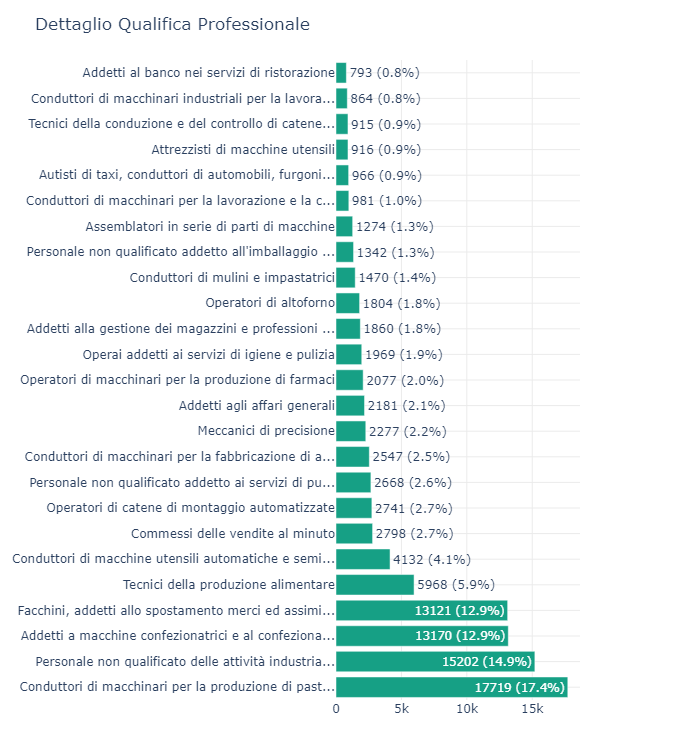
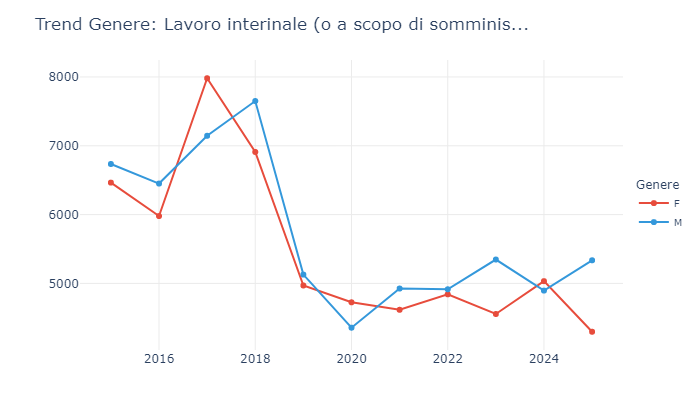
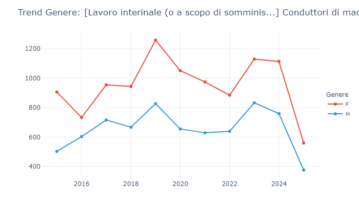
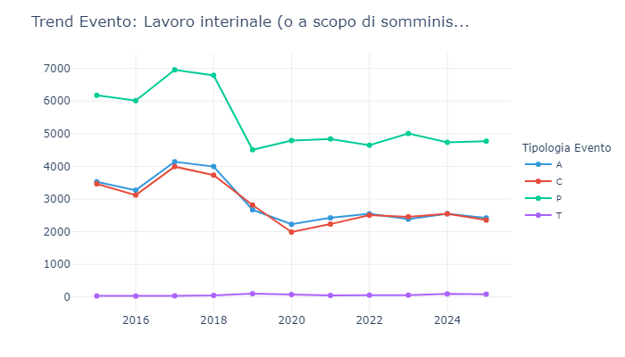
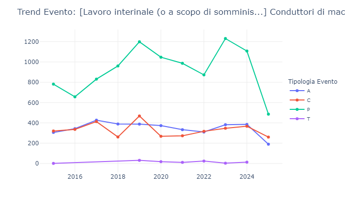
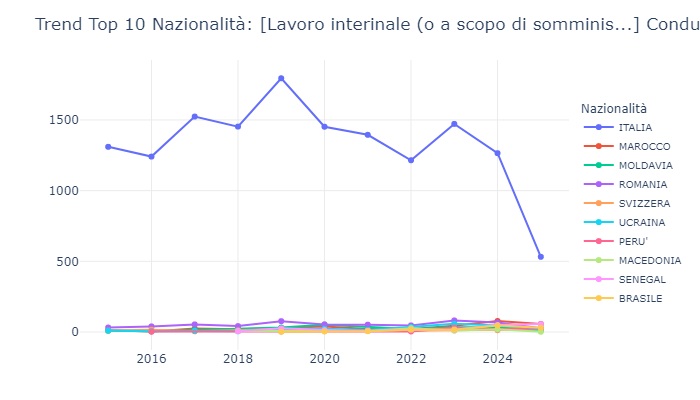
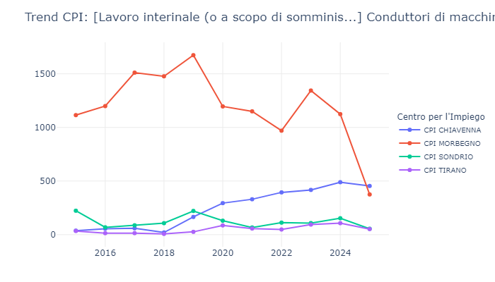
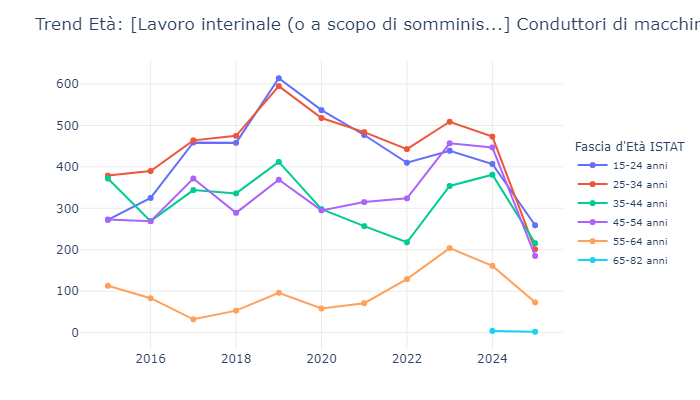

In questa sezione l'analisi si concentra sulle qualifiche professionali che generano i maggiori volumi di movimentazione nell'ambito della somministrazione, con particolare attenzione alle dinamiche che coinvolgono la fascia d'età 15-35 anni. Attraverso l'esame dei flussi desunti dalle Comunicazioni Obbligatorie, si intende mappare le tendenze amministrative chiave, offrendo una lettura rigorosa dell'intensità di ricorso allo strumento interinale. Dopo una disamina generale della distribuzione, lo studio isola un caso specifico: la qualifica di "Conduttori di macchinari per la produzione di pasticceria e prodotti da forno", figura centrale nei flussi di somministrazione provinciali e strettamente connessa all'industria di trasformazione alimentare.

## Dalla fabbrica alla mansione: la scomposizione del lavoro interinale, i "primi 4" fanno il mercato

##### Attività economiche nell'ambito del lavoro in somministrazione
::: {.content-visible when-format="html"}
<iframe src="esportazioni_quarto/grafico_2_COB_interinale_ateco_25.html" width="100%" height="450px" style="border:none;"></iframe>
:::

::: {.content-visible when-format="pdf"}
{#fig-Attivita-somministrazione width=60% fig-pos="H"}
:::

##### Qualificazioni professionali nell'ambito del lavoro in somministrazione
::: {.content-visible when-format="html"}
<iframe src="esportazioni_quarto/grafico_2_COB_qualifiche_25_cat_interinale.html" width="100%" height="450px" style="border:none;"></iframe>
:::

::: {.content-visible when-format="pdf"}
{#fig-qualificazioni-somministrazione width=100% fig-pos="H"}
:::

L'analisi burocratica della somministrazione raggiunge il massimo livello di dettaglio incrociando le volumetrie settoriali con le specifiche codifiche professionali. Se il primo grafico, relativo ai settori ATECO, ha evidenziato in quale comparto si concentra il carico burocratico, il secondo grafico, focalizzato sulle Qualifiche, fornisce un'inquadratura di dettaglio sulle specifiche mansioni oggetto di comunicazione. Il confronto tra le due viste traduce la categoria economica nella realtà operativa di stabilimento, evidenziando un'elevata concentrazione dei flussi su mansioni a bassa specializzazione e ad alta intensità manuale.

#### Il riflesso dell'alimentare: il dominio dei forni
Il primo grafico ATECO ha certificato un'egemonia delle "Industrie alimentari", comparto che assorbe il 42,6% delle comunicazioni in somministrazione (quasi 50.000 eventi). Tale concentrazione si riflette specularmente nella scomposizione per mansione: la qualifica che genera il maggior volume di pratiche è quella dei "Conduttori di macchinari per la produzione di pasticceria e prodotti da forno". Con 17.719 eventi registrati, questa singola e specifica mansione accentra il 17,4% dell'intero carico amministrativo interinale provinciale. Aggregando a tale dato i "Tecnici della produzione alimentare" (quinta posizione, 5,9%), si osserva che circa un quarto del traffico burocratico complessivo è assorbito da figure dedicate alla conduzione di impianti per la trasformazione del cibo.

#### I flussi operativi: logistica e confezionamento
La struttura complessiva delle movimentazioni emerge tuttavia dall'esame delle posizioni successive. Escludendo le specificità di linea alimentare o meccanica, si rilevano tre qualifiche a carattere trasversale e puramente operativo:
1. Personale non qualificato delle attività industriali (14,9% - oltre 15.000 movimentazioni)
2. Addetti a macchine confezionatrici e al confezionamento (12,9% - 13.170 eventi)
3. Facchini e addetti allo spostamento merci (12,9% - 13.121 comunicazioni)
La somma di queste tre categorie indica che oltre il 40% del volume burocratico complessivo è generato dalla gestione di mansioni generiche o di fine linea. Il ricorso alla somministrazione si configura pertanto come una leva orientata alla modulazione del flusso logistico: il confezionamento dei prodotti in uscita, la movimentazione di magazzino e il supporto operativo di base.

#### La meccanica e l'automazione
Oltre le prime cinque posizioni, la distribuzione percentuale si frammenta (tra l'1% e il 4%), rispecchiando l'incidenza burocratica delle filiere metallurgica, meccatronica e farmaceutica. Si rilevano i "Conduttori di macchine utensili automatiche" (4,1%), gli "Operatori di catene di montaggio automatizzate" (2,7%), i "Meccanici di precisione" (2,2%) e gli "Operatori di macchinari per la produzione di farmaci" (2,0%). La somministrazione non interviene sui profili di progettazione o apicali, bensì garantisce la copertura modulare delle postazioni operative di linea.

#### Il grande assente: i servizi al pubblico
La scomposizione per qualifica conferma la marginalità della somministrazione nei comparti relazionali e ricettivi, predominanti nei flussi diretti standard. I "Commessi delle vendite al minuto" si attestano in settima posizione (2,7%), mentre gli "Addetti al banco nei servizi di ristorazione" chiudono la rilevazione con uno 0,8%. L'unica eccezione nel terziario è costituita dalle movimentazioni del personale non qualificato addetto alle pulizie (2,6%), tipicamente soggetto a esternalizzazione.

#### In sintesi
I dati indicano un'elevata polarizzazione amministrativa. Le prime quattro qualifiche in elenco assorbono quasi il 60% (58,1%) del volume di pratiche in somministrazione. Questo dato delinea la concentrazione prevalente dei flussi amministrativi: le movimentazioni si focalizzano su figure di supporto posizionate sul confezionamento alimentare, sulla movimentazione merci o sul presidio generico delle linee durante i picchi di attività.



## Genere e mansioni: variazioni di tendenza nell'industria alimentare

L'analisi disaggregata dei flussi di genere per singola qualifica consente di isolare comportamenti organizzativi specifici. Il confronto tra le volumetrie generali della somministrazione e il dettaglio della mansione a maggiore densità burocratica (conduttori di macchinari per pasticceria) evidenzia una significativa variazione nell'incidenza amministrativa di genere.

##### Genere nell'ambito del lavoro in somministrazione
::: {.content-visible when-format="html"}
<iframe src="esportazioni_quarto/grafico_3COB_SEX_interinale.html" width="100%" height="450px" style="border:none;"></iframe>
:::

::: {.content-visible when-format="pdf"}
{#fig-sex-somministrazione width=60% fig-pos="H"}
:::

##### Genere nell'ambito della qualificazione di Conduttori di macchinari per la produzione di pasticceria e prodotti da forno
::: {.content-visible when-format="html"}
<iframe src="esportazioni_quarto/grafico_4_COB_SEX_qualifiche_Conduttori.html" width="100%" height="450px" style="border:none;"></iframe>
:::

::: {.content-visible when-format="pdf"}
{#fig-sex-qualifiche width=100% fig-pos="H"}
:::

#### La somministrazione aggregata: una prevalenza maschile
L'esame del volume totale degli eventi evidenzia una tendenza strutturale in cui le movimentazioni maschili, sia pure non di molto, risultano maggioritarie. Nel picco del 2018, ad esempio, il volume burocratico generato dalla componente maschile (7.650 eventi) ha superato quello femminile (6.910). Essendo l'istituto interinale strettamente legato all'operatività manifatturiera e logistica, la gestione amministrativa tende ad alimentare maggiori flussi di comunicazioni sui profili maschili.

#### L'eccezione dell'industria dolciaria: una prevalenza femminile
Isolando la qualifica "Conduttori di macchinari per la produzione di pasticceria e prodotti da forno" — fulcro del traffico burocratico provinciale (17,4%) — si osserva un'inversione di tendenza. In questo perimetro, l'incidenza delle COB a carico della componente femminile appare sistematicamente preponderante. Nel 2019, il carico amministrativo legato alla componente femminile ha registrato 1.259 eventi, a fronte degli 827 maschili; nel 2023 il divario si è mantenuto a 1.130 contro 833. Tale assetto riflette un'impostazione tecnica della filiera, in cui le attività di presidio, controllo e confezionamento di linea tendono storicamente ad assorbire volumi burocratici a netta prevalenza femminile.

##### La tenuta asimmetrica durante la pandemia (2020)
Il confronto temporale evidenzia reazioni disomogenee allo shock del 2020. Nell'aggregato generale, i flussi maschili hanno registrato una marcata flessione, passando da 7.650 eventi nel 2018 a 4.357 nel 2020, rispecchiando il rallentamento delle filiere metalmeccanica e logistica.
Nel segmento dolciario, la contrazione appare significativamente contenuta. Le movimentazioni relative alla componente femminile su questi macchinari sono passate da 1.259 COB nel 2019 a 1.051 nel 2020, mostrando un'elevata tenuta burocratica. L'inclusione della filiera alimentare tra i comparti essenziali ha garantito continuità alle transazioni amministrative legate a tali mansioni.

##### I riflessi di genere sulle flessioni del 2025
La specifica distribuzione di genere fornisce un elemento interpretativo per la contrazione delle movimentazioni rilevata nel 2025. La scadenza delle deroghe sui limiti di proroga, associata a possibili riassetti interni, ha innescato una rigorosa razionalizzazione dei flussi, pur in assenza di impatti analoghi sui volumi del CPI di riferimento (Morbegno).
Concentrandosi le movimentazioni burocratiche di questa linea prevalentemente sulle lavoratrici, la contrazione ha inciso in misura proporzionalmente più ampia sui flussi femminili. Gli eventi generati dalla componente femminile scendono da 1.114 COB nel 2024 a 560 nel 2025 (-50%), mentre i flussi maschili flettono da 759 a 376. L'introduzione di vincoli di conformità sui rinnovi genera pertanto impatti amministrativi asimmetrici in funzione della composizione di genere del comparto.

#### In sintesi
Il passaggio dai dati aggregati al dettaglio professionale conferma la disomogeneità delle logiche di somministrazione. Se a livello generale il supporto interinale genera volumi prevalenti sul segmento maschile, la scomposizione della principale filiera alimentare evidenzia un'elevata intensità burocratica a carico della componente femminile. Tale assetto rende i flussi femminili maggiormente esposti alle repentine variazioni normative che regolano la reiterazione dei contratti a termine.



## Eventi e flessibilità

##### Eventi nell'ambito del lavoro in somministrazione
::: {.content-visible when-format="html"}
<iframe src="esportazioni_quarto/grafico_5COB_EVENTI_interinale.html" width="100%" height="450px" style="border:none;"></iframe>
:::

::: {.content-visible when-format="pdf"}
{#fig-eventi-somministrazione width=60% fig-pos="H"}
:::

##### Eventi nell'ambito della qualificazione di Conduttori di macchinari per la produzione di pasticceria e prodotti da forno
::: {.content-visible when-format="html"}
<iframe src="esportazioni_quarto/grafico_6COB_EVENTI_conduttori.html" width="100%" height="450px" style="border:none;"></iframe>
:::

::: {.content-visible when-format="pdf"}
{#fig-eventi-qualifiche-conduttori width=100% fig-pos="H"}
:::

#### Tipologia di evento e flessibilità: l'uso strutturale delle proroghe e la frattura del 2025
La scomposizione delle COB per "Tipologia Evento" (Avviamenti [A], Cessazioni [C], Proroghe [P], Trasformazioni [T]) qualifica la natura amministrativa della gestione contrattuale. Il confronto tra l'aggregato generale e la mansione "Conduttori di macchinari" evidenzia un modello di reiterazione inizialmente analogo, soggetto a una netta divaricazione nel 2025.

#### Un modello condiviso: la reiterazione di lungo periodo
Le serie storiche condividono un'impostazione strutturale: il volume delle Proroghe (P) eccede costantemente i nuovi Avviamenti (A). Tale configurazione esclude uno scenario fondato su un turnover anagrafico continuo, delineando un sistema di gestione basato sull'estensione modulare: a fronte di un numero circoscritto di ingressi, i datori di lavoro reiterano il medesimo rapporto attraverso molteplici rinnovi ravvicinati. Nel 2018 l'aggregato generale registrava circa 4.000 avviamenti e 6.800 proroghe, proporzione ricalcata fedelmente dalle volumetrie del comparto dolciario. Le Trasformazioni (T) mantengono un'incidenza statistica trascurabile in entrambe le viste.

#### L'impatto normativo del 2019
L'elevata incidenza delle Proroghe rende le curve sensibili alle modifiche regolatorie. La discontinuità registrata nel 2019 coincide con l'implementazione del "Decreto Dignità". Nel mercato generale, il volume delle Proroghe subisce una severa contrazione (da 6.787 a 4.510). Nel segmento dolciario si osserva invece un temporaneo incremento delle estensioni (da 961 a 1.199), verosimilmente riconducibile alla propensione aziendale a saturare i margini di rinnovo transitori previsti dalla norma per preservare la continuità operativa, prima del successivo riallineamento.

#### Lo scostamento del 2025: una discontinuità settoriale
La principale divergenza emerge nell'ultima annualità rilevata, in cui le curve delle Proroghe (P) mostrano andamenti contrapposti:
La tenuta dell'aggregato generale: Il volume complessivo dei rinnovi si mantiene stabile (da 4.736 eventi nel 2024 a 4.773 nel 2025). Il bacino interinale provinciale conserva la propria operatività amministrativa standard.
La contrazione del settore dolciario: La curva specifica registra una flessione marcata. Il volume burocratico delle proroghe subisce un dimezzamento, passando dalle 1.108 unità del 2024 a quota 486 nel 2025 (-56%), con un conseguente impatto sui flussi di nuovo avviamento (da 385 a 190).

#### In sintesi
La stabilità burocratica dell'aggregato generale suggerisce che la flessione del 2025 non derivi da una contrazione sistemica della somministrazione. La forte contrazione dei rinnovi circoscritta alla filiera dolciaria conferma l'esistenza di una criticità strettamente localizzata. Il venir meno delle deroghe e la probabile ridefinizione dei parametri aziendali interni sembrano aver compresso la reiterazione contrattuale su quella specifica linea produttiva, lasciando inalterata l'operatività del restante tessuto interinale. Tali letture rimangono soggette a future verifiche empiriche, potendo la varianza dei dati dipendere da fattori esogeni o da specifiche modalità di tracciamento amministrativo.



## Nazionalità, CPI, età

##### Nazionalità nell'ambito del lavoro in somministrazione
::: {.content-visible when-format="html"}
<iframe src="esportazioni_quarto/grafico_8COB_NAZ_conduttori.html" width="100%" height="450px" style="border:none;"></iframe>
:::

::: {.content-visible when-format="pdf"}
{#fig-nazionalita-somministrazione.conduttori width=60% fig-pos="H"}
:::

#### Nazionalità: consolidamento e nuovi ingressi
I flussi evidenziano che le movimentazioni per questa figura poggiano su una base consolidata di flussi nazionali, registrando al contempo l'assorbimento di specifiche componenti estere.
Prevalenza italiana: Il volume burocratico ascrivibile a lavoratori italiani si mantiene maggioritario. Al netto della flessione del 2025, il volume delle pratiche amministrative gestite rappresenta il principale indicatore di attività della mansione, in controtendenza rispetto alla progressiva erosione interna rilevata nei dati aggregati.
Integrazione dei flussi: L'incremento delle COB relative a cittadini marocchini (picco di 78 eventi nel 2024) e senegalesi indica un fabbisogno operativo assorbito attraverso canali di immigrazione stabilizzata, con volumi di movimentazione che riflettono l'inserimento formale all'interno dei cicli produttivi.

##### CPI nell'ambito del lavoro in somministrazione
::: {.content-visible when-format="html"}
<iframe src="esportazioni_quarto/grafico_10COB_CPI_conduttori.html" width="100%" height="450px" style="border:none;"></iframe>
:::

::: {.content-visible when-format="pdf"}
{#fig-cpi-somministrazione.conduttori width=60% fig-pos="H"}
:::

#### Centri per l'Impiego (CPI): la transizione dei flussi
La scomposizione territoriale quantifica i carichi burocratici in base alla sede operativa o di competenza amministrativa.
La transizione territoriale Morbegno-Chiavenna: Si osserva una progressiva ricollocazione territoriale. Mentre il CPI di Morbegno mostra una contrazione delle movimentazioni dopo il triennio 2017-2019, il bacino di Chiavenna registra un incremento costante. I flussi amministrativi si intensificano verso la Valchiavenna, divenuta nel 2024 il polo primario per volume di COB trasmesse, in concomitanza con la citata flessione delle proroghe su Morbegno.
Volumi di presidio: I CPI di Sondrio e Tirano mantengono quote di movimentazione residuali, correlate a unità di minore dimensione o a un minore ricorso all'intermediazione per tale qualifica.

##### Età nell'ambito del lavoro in somministrazione
::: {.content-visible when-format="html"}
<iframe src="esportazioni_quarto/grafico_12COB_ETA_conduttori.html" width="100%" height="450px" style="border:none;"></iframe>
:::

::: {.content-visible when-format="pdf"}
{#fig-eta-somministrazione.conduttori width=60% fig-pos="H"}
:::

La stratificazione anagrafica delle COB evidenzia un'elevata concentrazione di eventi sulle fasce di ingresso.
Concentrazione giovanile (15-34 anni): I volumi burocratici cumulati nelle prime due coorti rappresentano la quota prevalente delle transazioni. La conduzione di impianti di pasticceria si conferma un canale di accesso primario per i giovani inseriti nei flussi di agenzia.
Movimentazioni centrali: Il volume di COB generato dalla fascia 45-54 anni (stabile fino al 2024) indica che la gestione amministrativa coinvolge regolarmente anche profili maturi, verosimilmente soggetti a reiterazioni stagionali o missioni operative ricorrenti.

#### In sintesi
Le volumetrie burocratiche confermano l'elevata intensità amministrativa del comparto dolciario. Il dato saliente è la polarizzazione dei flussi di comunicazione verso il bacino di Chiavenna. Sotto il profilo anagrafico ed etnico, le movimentazioni indicano un forte assorbimento di profili giovanili e un progressivo consolidamento burocratico delle comunità straniere (marocchina e senegalese), che registrano un incremento del proprio peso specifico sui volumi di attivazione nel corso del decennio.